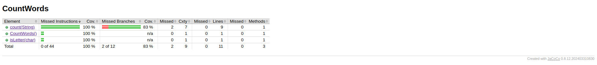
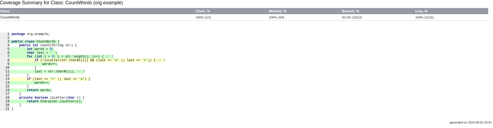
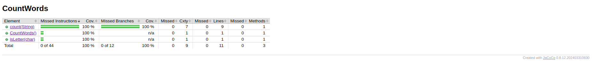
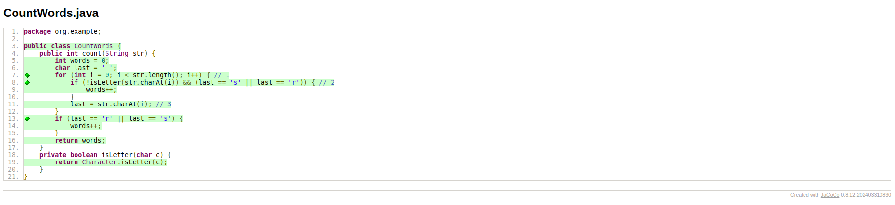
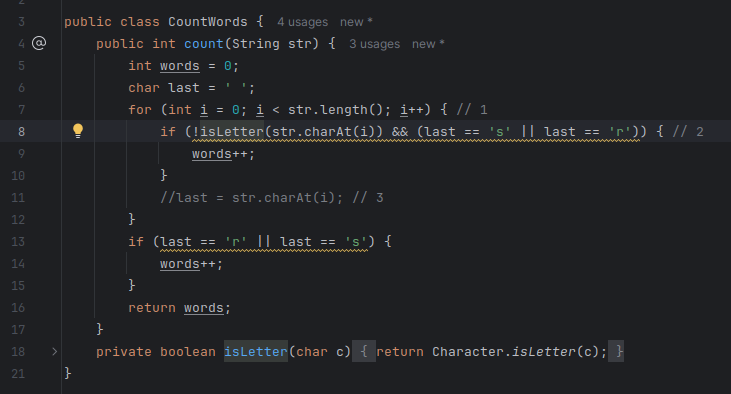

```java
public class CountWords {
    public int count(String str) {
        int words = 0;
        char last = ' ';
        for (int i = 0; i < str.length(); i++) { // 1
            if (!isLetter(str.charAt(i)) && (last == 's' || last == 'r')) { // 2
                words++;
            }
            last = str.charAt(i); // 3
        }
        if (last == 'r' || last == 's') {
            words++;
        }
        return words;
    }
    private boolean isLetter(char c) {
        return Character.isLetter(c);
    }
}
```

### Ejercicio 1
El proposito del programa es contar solo las palabras del string que terminan en s o r.
**Linea 1:** Se itera en funcion del tamaño del string *str*.

**Linea 2:**
Es una condicional la cual dependiendo de la veracidad se ejecuta la suma de *words* o no.
Se verifica si el caracter actual es un espacio vacio si no lo es simplemente seguimos avanzando, pero si lo es se da la veracidad si el caracter anterior (last) es "s" o "r".

**Linea 3:**
La variable *last* indica cual es el caracter anterior. Se almacena el caracter actual como el futuro caracter anterior mediante esta variable.


### Ejercicio 2

Explica qué hacen las líneas 1 y 2 del código. . Presenta un informe generado por JaCoCo
(www.jacoco.org/jacoco) u otra herramienta de cobertura de código de tu preferencia en el IDE del
curso.

```java
public class CountWordTest {
    @Test
    void twoWordsEndingWithS() { // 1
        int words = new CountWords().count("dogs cats");
        assertThat(words).isEqualTo(2);
    }
    @Test
    void noWordsAtAll() { // 2
        int words = new CountWords().count("dog cat");
        assertThat(words).isEqualTo(0);
    }

}
```
### Solución:

**Linea 1:**
Es una prueba unitaria donde como parametro tenemos 2 palabras que terminan en "s", se espera un retorno de 2 y esto indica que **siempre** se ejecuta lo que hay dentro de la condicional en este caso.

**Linea 2:**
Es una prueba unitaria donde como parametro tenemos 2 palabras que NO terminan en "s", se espera un retorno de 2 y esto indica que **nunca** se ejecuta lo que hay dentro de la condicional en este caso.

**Analisis de cobertura con Jacoco:** <br/>







*Verde:* Se ejecutó al menos una vez durante la ejecución de las pruebas. <br/>
*Amarillo:* Se ejecuto parcialmente. <br/>
*Rojo:* No se ejecuto ni una vez en las pruebas. <br/>

Jacoco indica en el metodo count() un coverage del 83% esto es debido a que no se ha analizado el caso de las palabras que terminan en "r" por lo que hay una incertidumbre grande si estas podrian pasar las pruebas o no.

### Ejercicio 3

Explica la línea 1 y con el caso de prueba recién agregado en el conjunto de pruebas,
vuelve a ejecutar la herramienta de cobertura. Explica los cambios obtenidos.

```java
@Test
void wordsThatEndInR() { // 1
    int words = new CountWords().count("car bar");
    assertThat(words).isEqualTo(2);
}
```
### Solución:

**Linea 1:**
Es una prueba unitaria donde como parametro tenemos 2 palabras que terminan en "r", se espera un retorno de 2 y esto indica que **siempre** se ejecuta lo que hay dentro de la condicional en este caso.

Añadimos este unit test a la clase CountWordTest. <br/>

**Analisis de cobertura con Jacoco:** <br/>





Jacoco indica en el metodo count() un coverage del 100% esto es debido a que una vez analizado el caso de las palabras que terminan en "r" ya tenemos todos los casos posibles a testear.


### Ejercicio 4

### Parte A:
```java
public class CountWords {
    public int count(String str) {
        int words = 0;
        char last = ' ';
        for (int i = 0; i < str.length(); i++) { // 1
            if (!isLetter(str.charAt(i)) && (last == 's' || last == 'r')) { // 2
                words++;
            }
            last = str.charAt(i); // 3
        }
        if (last == 'r' || last == 's') {
            words++;
        }
        return words;
    }
    private boolean isLetter(char c) {
        return Character.isLetter(c);
    }
}
```
### Solución:
1. Explica qué hacen las líneas 1, 2 y 3 en el código. <br/>
Explicado en el Ejercicio 1. <br/>

2. ¿Qué sucedería si se eliminara la línea 3 del código? <br/>
La variable *last* seria siempre ' ', esto quiere decir que la condicional de la linea 2 seria siempre falsa y la otra tambien, por lo que words seria 0.
Inclusive el editor lo indica.



3. Escribe una descripción de alto nivel de lo que hace este método count. <br/>
El proposito del programa es contar solo las palabras del string que terminan en s o r.


### Parte B:
```java
public class CountWordTest {
    @Test
    void twoWordsEndingWithS() { // 1
        int words = new CountWords().count("dogs cats");
        assertThat(words).isEqualTo(2);
    }
    @Test
    void noWordsAtAll() { // 2
        int words = new CountWords().count("dog cat");
        assertThat(words).isEqualTo(0);
    }
}
```
### Solución:
4. Explica qué hacen las líneas 1 y 2 del código de prueba.<br/>
Explicado en el Ejercicio 2. <br/>

5. ¿Qué tipos de casos de prueba adicionales se deberían agregar para mejorar la cobertura?<br/>
Donde el caso sean palabras que acaben en "r", una acabe en "r" y la otra no, una acabe en "s" y la otra no, una acabe en "r" y la otra en "s". <br/>


### Parte C: Ejecución de Herramienta de Cobertura
6. Ejecuta las pruebas unitarias usando JaCoCo o una herramienta de cobertura de código de tu elección.<br/>
Explicado en el Ejercicio 2 en la seccion "Analisis de cobertura con Jacoco", esta en imagen. <br/>

7. Genera y presenta el informe de cobertura.<br/>
Explicado en el Ejercicio 2 en la seccion "Analisis de cobertura con Jacoco", esta en imagen. <br/>

8. Identifica las partes del código que no están cubiertas por las pruebas.<br/>
De la imagen se ve que la linea 8 y la linea 13 no estan cubiertas y estan indicadas de color amarillo, esto debido a que al no existir ninguna prueba unitaria que testee el caso donde una palabra termina en "r" hay una gran incertidumbre y no se sabe si se podria pasar la prueba unitaria o no en este caso.<br/>


### Ejercicio 5: Extensión de pruebas
### Parte A: Nuevas pruebas
Escribe nuevas pruebas unitarias para cubrir los casos que no están cubiertos actualmente. Usa el siguiente formato como guía.
```java
@Test
void wordsThatEndInR() { // 1
    int words = new CountWords().count("car bar");
    assertThat(words).isEqualTo(2);
}
```

### Parte B: Ejecución de herramienta de cobertura
1. Agrega las nuevas pruebas al conjunto de pruebas.
```java
public class CountWordTest {
    @Test
    void twoWordsEndingWithS() { // 1
        int words = new CountWords().count("dogs cats");
        assertThat(words).isEqualTo(2);
    }
    @Test
    void noWordsAtAll() { // 2
        int words = new CountWords().count("dog cat");
        assertThat(words).isEqualTo(0);
    }
    @Test
    void wordsThatEndInR() { // 1
	int words = new CountWords().count("car bar");
	assertThat(words).isEqualTo(2);
    }
}
```
2. Vuelve a ejecutar la herramienta de cobertura.
3. Explica los cambios obtenidos en el informe de cobertura. <br/>
2 y 3 realizados en el Ejercicio 3 en la seccion "Analisis de cobertura con Jacoco".

4. Si todavía hay partes del código no cubiertas, repite el proceso: identifica las partes no cubiertas, comprende por qué no están cubiertas y escribe una prueba que ejerza esa parte del código. <br/>
Como se puede ver en las imagenes el Coverage se indica que es de 100% por lo que no hay partes no cubiertas en nuestro codigo y todo el codigo esta bajo prueba.


### Ejercicio 6: Exploración y mejora
### Parte A: Exploración
1. Modifica el método count para mejorar su claridad o eficiencia.

2. Escribe pruebas unitarias adicionales para asegurar que las modificaciones no rompan la funcionalidad existente.

### Parte B: Informe final
3. Genera un informe final de cobertura después de todas las modificaciones y nuevas pruebas.
4. Compara el informe final con el informe inicial y discute los cambios y mejoras en la cobertura de código.


### Ejercicio 7: presenta un gráfico de flujo de control (CFG) del programa CountWords


**Linea 1:**
Es una prueba unitaria donde como parametro tenemos 2 palabras que terminan en "r", se espera un retorno de 2 y esto indica que **siempre** se ejecuta lo que hay dentro de la condicional en este caso.

Añadimos este unit test a la clase CountWordTest. <br/>

**Analisis de cobertura con Jacoco:** <br/>

ex3_jacoco_methods

ex3_jacoco_code


Jacoco indica en el metodo count() un coverage del 100% esto es debido a que una vez analizado el caso de las palabras que terminan en "r" ya tenemos todos los casos posibles a testear.


### Ejercicio 8: Cobertura de línea

### Ejercicio 9: Cobertura de ramas


### Ejercicio 10: Condición + cobertura de rama
Asegurar que cada condición y cada rama del código en el método count esté cubierta por al menos una prueba unitaria.


### Ejercicio 11: Cobertura de rutas
Asegurar que todas las rutas posibles de ejecución en el método count estén cubiertas por al menos una prueba unitaria.


```java
public class LeftPadUtils {
    private static final String SPACE = " ";
    private static boolean isEmpty(final CharSequence cs) {
        return cs == null || cs.length() == 0;
    }
    /**
     * @param str
     * @param size
     * @param padStr
     * @return left-padded string or {@code null}
     */
    public static String leftPad(final String str, final int size, String padStr) {
        if (str == null) { // 1
            return null;
        }
        if (isEmpty(padStr)) { // 2
            padStr = SPACE;
        }
        final int padLen = padStr.length();
        final int strLen = str.length();
        final int pads = size - strLen;
        if (pads <= 0) { // 3 
            return str;
        }
        if (pads == padLen) { // 4
            return padStr.concat(str);
        } else if (pads < padLen) { // 5
            return padStr.substring(0, pads).concat(str);
        } else { // 6
            final char[] padding = new char[pads];
            final char[] padChars = padStr.toCharArray();
            for (int i = 0; i < pads; i++) {
                padding[i] = padChars[i % padLen];
            }
            return new String(padding).concat(str);
        }
    }
}
```
### Ejercicio 12: Explica los comentarios 1, 2, 3, 4 y 5 del código anterior


### Ejercicio 13: Explica las líneas 1, 2 y 3.
```java
public class LeftPadTest {
    @ParameterizedTest
    @MethodSource("generator")
    void test(String originalStr, int size, String padString, String expectedStr) { // 1
        assertThat(LeftPadUtils.leftPad(originalStr, size, padString)).isEqualTo(expectedStr);
    }
    static Stream<Arguments> generator() { // 2
        return Stream.of(
                Arguments.of(null, 10, "-", null), // T1
                Arguments.of("", 5, "-", "-----"), // T2
                Arguments.of("abc", -1, "-", "abc"), // T3
                Arguments.of("abc", 5, null, " abc"), // T4
                Arguments.of("abc", 5, "", " abc"), // T5
                Arguments.of("abc", 5, "-", "--abc"), // T6
                Arguments.of("abc", 3, "-", "abc"), // T7
                Arguments.of("abc", 0, "-", "abc"), // T8
                Arguments.of("abc", 2, "-", "abc") // T9
        );
    }
}
```


### Ejercicio 14
Agrega estos tres casos de prueba adicionales a la prueba parametrizada, como se
muestra en el listado, y vuelve a ejecutar la herramienta de cobertura. Explica el informe obtenido,
¿es similar al anterior? Explica tu respuesta.


### Ejercicio 15:
Agrega este caso de prueba adicional a la prueba parametrizada y vuelve a ejecutar la
herramienta de cobertura. Explica el informe obtenido, ¿es similar al anterior? Explica tu respuesta.

### Ejercicio 16: Explica las líneas 1, 2 y 3 del codigo anterior.
### Ejercicio 17:
Escribe caso de prueba y vuelve a ejecutar la herramienta de cobertura. Explica el
informe obtenido Explica tu respuesta. ¿ Se logra una cobertura de ramas del 100%?. ¿Se puede
confiar ciegamente en la cobertura? .
### Ejercicio 18: Explica las líneas 1, 2 y 3 del codigo anterior.

### Ejercicio 19:
Escribe caso de prueba y vuelve a ejecutar la herramienta de cobertura. Explica el
informe obtenido. Explica tu respuesta. ¿Se logra una cobertura de ramas del 100%? ¿Se puede
confiar ciegamente en la cobertura?

### Ejercicio 20: 
Agrega estos tres casos de prueba adicionales a la prueba parametrizada, como se
muestra en el listado, y vuelve a ejecutar la herramienta de cobertura. Explica el informe obtenido,
¿es similar al anterior? Explica tu respuesta.
### Ejercicio 21: 
Agrega este caso de prueba adicional a la prueba parametrizada y vuelve a ejecutar la
herramienta de cobertura. Explica el informe obtenido, ¿es similar al anterior? Explica tu respuesta.

Considera las siguientes pruebas unitarias:
### Ejercicio 22: Comprender las Pruebas de Mutación
Comprende los conceptos básicos y la terminología de las pruebas de mutación.
### Ejercicio 23: Introducción a PIT (Pitest)
Configurar y ejecutar pruebas de mutación utilizando PIT en un proyecto Java.
### Ejercicio 24: Mejorar el conjunto de pruebas
Mejorar el conjunto de pruebas basado en el informe de mutación
### Ejercicio 25: Crear Mutantes manualmente
Comprender cómo se generan los mutantes y probar manualmente si las pruebas los detectan.
### Ejercicio 26: Análisis detallado de mutantes

