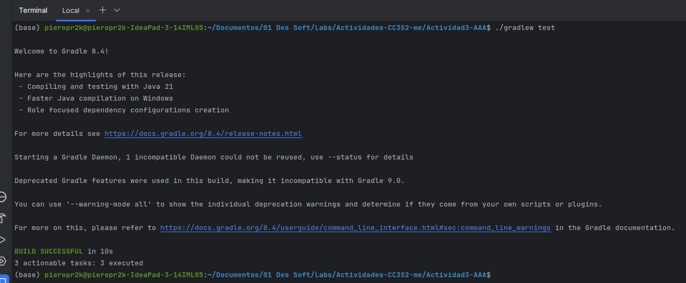
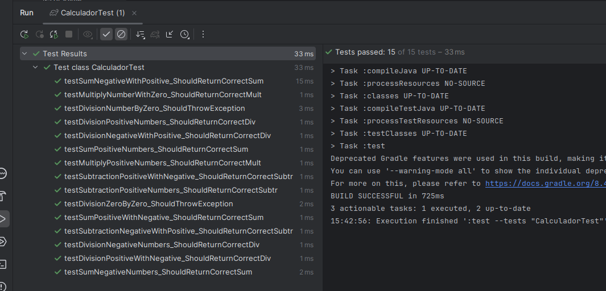

# AAA en pruebas unitarias


Creamos la clase `Calculator.java` en `src/main/java` y sus respectivas pruebas unitarias.

Luego tenemos que completar el archivo `CalculatorTest.java`.

Entonces creamos los metodos restantes y viendo todas las posibles combinaciones.

1. Codigo fuente de la clase `Calculator.java`.
El codigo proporcionado estaba casi completo, pero lo que faltaba era analizar el caso del método
`division(numberA,numberB)` cuando `numberB < 0` y `numberA = 0` ya que ahi se lanzan excepciones.

Codigo de la clase Calculador en `Calculador.java`:

```java
package org.example.main;

public class Calculador {

    public int sumar(int numeroA, int numeroB) {
        return numeroA + numeroB;
    }

    public int restar(int numeroA, int numeroB) {
        return numeroA - numeroB;
    }

    public int multiplicacion(int numeroA, int numeroB) {
        return numeroA * numeroB;
    }

    public double division(int numeroA, int numeroB) {
        if (numeroB == 0) {
            throw new ArithmeticException("Division por cero");
        }
        return (double) numeroA / numeroB;
    }
}
```

2. Las pruebas unitarias se encuentran en `CalculadorTest.java`.

```java
import org.example.main.Calculador;
import org.junit.jupiter.api.BeforeEach;
import org.junit.jupiter.api.Test;
import static org.junit.jupiter.api.Assertions.*;

public class CalculadorTest {
    private Calculador calculador;
    int numeroA;
    int numeroB;

    @BeforeEach
    void setUp(){
        // Arrange
        calculador = new Calculador();
        numeroA = 10;
        numeroB = 5;
    }

    @Test
    public void testSumPositiveNumbers_ShouldReturnCorrectSum() {
        // Arrange was in BeforeEach
        // Act
        int resultado = calculador.
                sumar(numeroA, numeroB);
        // Assert
        assertEquals(15, resultado, "10 + 5 deberia ser 15");
    }

    @Test
    public void testSumNegativeNumbers_ShouldReturnCorrectSum() {
        // Arrange
        numeroA = -10;
        numeroB = -5;
        // Act
        int resultado = calculador.
                sumar(numeroA, numeroB);
        // Assert
        assertEquals(-15, resultado, "(-10) + (-5) deberia ser -15");
    }

    @Test
    public void testSumNegativeWithPositive_ShouldReturnCorrectSum() {
        // Arrange
        numeroA = -10;
        // Act
        int resultado = calculador.
                sumar(numeroA, numeroB);
        // Assert
        assertEquals(-5, resultado, "(-10) + (5) deberia ser -5");
    }

    @Test
    public void testSumPositiveWithNegative_ShouldReturnCorrectSum() {
        // Arrange
        numeroB = -5;
        // Act
        int resultado = calculador.
                sumar(numeroA, numeroB);
        // Assert
        assertEquals(5, resultado, "10 + (-5) deberia ser 5");
    }

    @Test
    public void testSubtractionPositiveNumbers_ShouldReturnCorrectSubtr() {
        // Arrange was in BeforeEach
        // Act
        int resultado = calculador.restar(numeroA, numeroB);
        // Assert
        assertEquals(5, resultado, "10 - 5 deberia ser 5");
    }

    @Test
    public void testSubtractionNegativeWithPositive_ShouldReturnCorrectSubtr() {
        // Arrange
        numeroA = -10;
        // Act
        int resultado = calculador.restar(numeroA, numeroB);
        // Assert
        assertEquals(-15, resultado, "-10 - 5 deberia ser -15");
    }

    @Test
    public void testSubtractionPositiveWithNegative_ShouldReturnCorrectSubtr() {
        // Arrange
        numeroB = -5;
        // Act
        int resultado = calculador.restar(numeroA, numeroB);
        // Assert
        assertEquals(15, resultado, "10 - (-5) deberia ser 15");
    }

    @Test
    public void testMultiplyPositiveNumbers_ShouldReturnCorrectMult() {
        // Arrange was in BeforeEach
        // Act
        int resultado = calculador.multiplicacion(numeroA, numeroB);
        // Assert
        assertEquals(50, resultado, "10 * 5 deberia ser 50");
    }

    @Test
    public void testMultiplyNumberWithZero_ShouldReturnCorrectMult() {
        // Arrange
        numeroB = 0;
        // Act
        int resultado = calculador.multiplicacion(numeroA, numeroB);
        // Assert
        assertEquals(0, resultado, "10 * 0 deberia ser 0");
    }

    @Test
    public void testDivisionPositiveNumbers_ShouldReturnCorrectDiv() {
        // Arrange was in BeforeEach
        // Act
        double resultado = calculador.division(numeroA, numeroB);
        // Assert
        assertEquals(2, resultado, "10 / 5 deberia ser 2");
    }

    @Test
    public void testDivisionNegativeNumbers_ShouldReturnCorrectDiv() {
        // Arrange
        numeroA = -10;
        numeroB = -5;
        // Act
        double resultado = calculador.division(numeroA, numeroB);
        // Assert
        assertEquals(2, resultado, "-10 / -5 deberia ser 2");
    }

    @Test
    public void testDivisionPositiveWithNegative_ShouldReturnCorrectDiv() {
        // Arrange
        numeroB = -5;
        // Act
        double resultado = calculador.division(numeroA, numeroB);
        // Assert
        assertEquals(-2, resultado, "10 / -5 deberia ser -2");
    }

    @Test
    public void testDivisionNegativeWithPositive_ShouldReturnCorrectDiv() {
        // Arrange
        numeroA = -10;
        // Act
        double resultado = calculador.division(numeroA, numeroB);
        // Assert
        assertEquals(-2, resultado, "-10 / 5 deberia ser -2");
    }

    @Test
    public void testDivisionNumberByZero_ShouldThrowException() {
        // Arrange
        numeroA = -10;
        numeroB = 0;

        // Act
        Exception exception = assertThrows(ArithmeticException.class, () -> calculador.division(numeroA, numeroB));

        // Assert
        assertNotNull(exception);
        assertEquals("Division por cero", exception.getMessage());
    }

    @Test
    public void testDivisionZeroByZero_ShouldThrowException() {
        // Arrange
        numeroA = 0;
        numeroB = 0;

        // Act
        Exception exception = assertThrows(ArithmeticException.class, () -> calculador.division(numeroA, numeroB));

        // Assert
        assertNotNull(exception);
        assertEquals("Division por cero", exception.getMessage());
    }
}

```
Del código mostrado todas las funciones tienen un BeforeEach para las 2 variables: *numeroA* y *numeroB*.
Sin embargo si no se vuelven a declarar estas variables dentro del método, esto quiere decir que los casos son normales (no limite ni negativos), caso contrario estamos ante un caso limite o negativo.

En base a este código se contestará los items de la tarea:

1. Escribir pruebas para las demás operaciones: Siguiendo el ejemplo dado, deben escribir pruebas unitarias para los otros métodos en la clase Calculator, asegurándose de cubrir casos de prueba variados, incluidos los casos límite como la división por cero. <br/>
Rpta: Hecho en la parte de arriba

2. Pruebas para casos negativos: Además de los casos de éxito,deben escribir pruebas para manejar casos negativos, por ejemplo, capturando excepciones esperadas. <br/>
Rpta: Del código se puede concluir que en los métodos *testDivisionNumberByZero_ShouldThrowException()*  y *testDivisionZeroByZero_ShouldThrowException()*  se manejan casos negativos: estos son de la division entre 0 porque se sabe que esta operación puede romper el programa y lanzar excepciones, por esta razón en estos métodos se maneja las pruebas para los casos negativos
3. Cobertura de casos de Prueba: Las pruebas deben cubrir una gama de casos de entrada, incluidos casos límite y negativos. <br/>
Rpta: En el código se cubren tanto los casos limite: ejecución de las funciones de suma, resta y division con números negativos y la multiplicación con 0, también los casos negativos: la division con 0 de las cuales se menciono previamente.

3. Archivo `build.gradle`:

```gradle
plugins {
    id 'java'
}

group = 'org.example'
version = '1.0-SNAPSHOT'

repositories {
    mavenCentral()
}

dependencies {
    testImplementation platform('org.junit:junit-bom:5.9.1')
    testImplementation 'org.junit.jupiter:junit-jupiter'
    testImplementation 'org.assertj:assertj-core:3.23.1'
}

test {
    useJUnitPlatform()
}
```

4. Instrucciones breves sobre cómo construir y ejecutar las pruebas utilizando Gradle.

Los pasos para contruir y ejecutar las pruebas con Gradle son los siguientes:

1. Configurar el archivo `build.gradle`.
2. Construir y programar los metodos para `CalculatorTest.java`.
3. Usanr el patron `AAA`, para cada test
   - Arrange: para preparar la configuracion necesaria previa a la prueba.
   - Act : aplicar el metodo y obtener su salida.
   - Assert : comparar la salida con el resultado esperado
  
Resultados de las pruebas:
Independientemente del editor o IDE que uses, puedes usar la terminal y ejecutar `./gradlew test`.

Se verá lo siguiente:



En Visual Studio Code, si usamos la extension `Java Runner`, podemos correr la clase `CalculatorTest.java` y ver lo siguiente:


