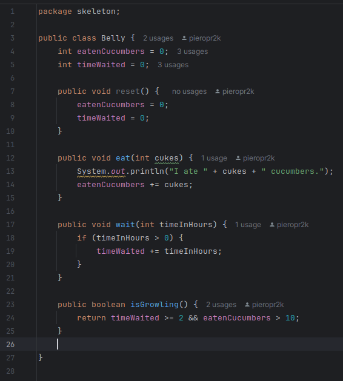
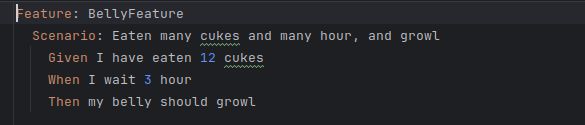
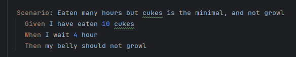
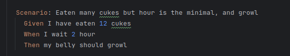
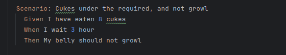
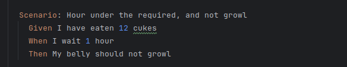
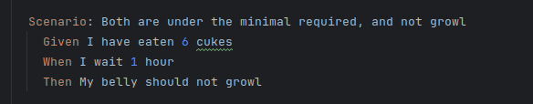
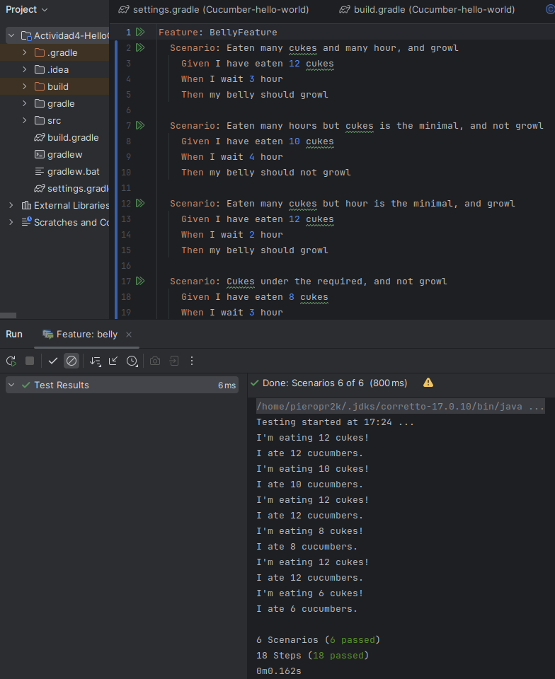

# Actividad 4: Introducción a Cucumber

En esta actividad tenemos un código que hace la simulacion de un estomago (Belly) el cual come pepinos y espera un tiempo necesario (donde no come pepinos) y dependiendo de eso gruñe o no.

La clase Belly (estomago) tiene 2 variables (eatenCucumbers & timeWaited) para calcular la cantidad de pepinos comidos y tiempo esperado.  
Solo si el tiempo esperado (timeWaited) es mayor igual que 2 y ha comido mas de 10 pepinos (eatenCucumbers) entonces el estomago va a gruñir.

Para poder realizar las pruebas debemos tomar en cuenta los siguientes casos:

- timeWaited >= 2 && eatenCucumbers > 10 (caso base)
1. timeWaited >= 2 && eatenCucumbers = 10 
2. timeWaited = 2 && eatenCucumbers > 10 
3. timeWaited >= 2 && eatenCucumbers < 10
4. timeWaited <= 2 && eatenCucumbers > 10
5. timeWaited <= 2 && eatenCucumbers < 10

En el siguiente codigo se abordan estos casos: desde el caso base hasta el caso 5

Entonces debemos escribir los escenarios para los casos 1, 2, 3, 4 y 5

- **Caso 1 - timeWaited >= 2 && eatenCucumbers = 10**

- **Caso 2 - timeWaited = 2 && eatenCucumbers > 10**

- **Caso 3 - timeWaited >= 2 && eatenCucumbers < 10**

- **Caso 4 - timeWaited <= 2 && eatenCucumbers > 10**

- **Caso 5 - timeWaited <= 2 && eatenCucumbers < 10**

Por último se ejecutan los escenearios y observamos que todos pasan satisfactoriamente.

