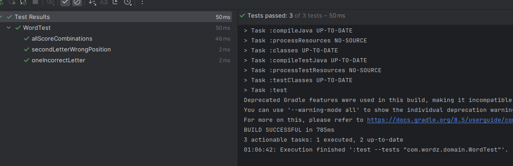
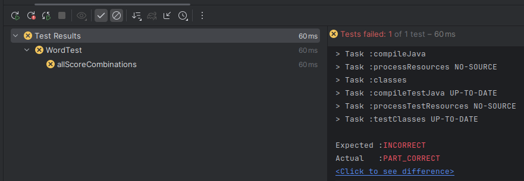

# Ritmo TDD

Vamos a vaciar el metodo assess de la clase Score, esto se hara con el fin de que se pueda hacer el testing aplicando TDD.

```java
package com.wordz.domain;

import java.util.ArrayList;
import java.util.Arrays;
import java.util.List;

public class Score {
    private final String correct;
    private Letter resultado = Letter.INCORRECT ;
    public Score(String correct) {
        this.correct = correct;
    }
    public Letter letter(int position) {
        return resultado;
    }
    public void assess(int position, String attempt) {
        // completar codigo
    }
}
```
En este caso aplicaremos el ciclo de refactorización RGR (red, green, refactor)


### 1er ciclo TDD

Esta prueba unitaria verifica si la letra de la primera posicion (osea 0) que corresponde a la palabra correcta y la palabra intento coinciden.

```java
@Test
public void oneCorrectLetter() {
    var word = new Word("A");
    var score = word.guess("A");
    assertThat(score.letter(0)).isEqualTo(Letter.CORRECT);
}
```

<span style="color:red;">1. RED</span>

Veamos como funciona la prueba: se esperaba CORRECT pero se obtuvo INCORRECT. Esto se debe a que siempre letter() devuelve INCORRECT (no tiene ninguna logica implementada aun en assess()).


<span style="color:green;">2. GREEN</span>

Ahora a mejorar el código de las clases que estan en main para que la prueba pase, en este caso el metodo assess() en Score ahora verificara si el caracter en la posición **position** de ambas cadenas es el mismo y si esto se cumple se almacena Letter.CORRECT en la variable de instancia resultado.

```java
public class Score {
    private final String correct;
    private Letter resultado = Letter.INCORRECT ;
    public Score(String correct) {
        this.correct = correct;
    }
    public Letter letter(int position) {
        return resultado;
    }
    
    public void assess(int position, String attempt) {
        if ( correct.charAt(position) == attempt.charAt(position)){
            resultado = Letter.CORRECT;
        }
    }
}
```

```java
public class Word {
    private final String word;
    public Word(String correctWord) {
        this.word = correctWord;
    }
    public Score guess(String attempt) {
        var score = new Score(word);
        score.assess( 0, attempt );
        return score;
    }
}
```

El método guess() de la clase Word llama al método assess() de Score que hace que se modifique el atributo *resultado* de la clase Word, justo este atributo que luego sera retornado por el metodo letter() para hacer la verificación en la prueba.


Se puede ver que las pruebas pasan


 <span style="color:blue;">3. REFACTOR</span>

El codigo esta mejorable.
Una vez que se ejecutaron las pruebas y pasaron,  pero hay que hacer que el codigo sea lo mas optimo posible. Por lo que ahora trataremos de controlar los code smells...

Podemos extraer la comparacion del metodo assess() e implementarla en un metodo isCorrectLetter() de tal forma que todo este entendible:

```java
public void assess(int position, String attempt) {
    if (isCorrectLetter(position, attempt)){
        resultado = Letter.CORRECT;
    }
}

private boolean isCorrectLetter(int position, String attempt) {
    return correct.charAt(position) == attempt.charAt(position);
}
```

De momento, del codigo de la fase RED, se puede ver en el metodo letter() que como parametro esta el metodo position sin embargo este parametro no influye en nada del codigo, ademas hay que considerar que de momentos solo se esta evaluando la posicion 0 de la palabra.
Asi que la siguiente refactorizacion seria convertir position en un atributo de la clase para que nos sea util cuando queramos adivinar la posicion 1 o 2 o la ultima de la palabra.

```java
public class Score {
    private final String correct;
    private Letter resultado = Letter.INCORRECT ;
    private int position;
    
    public Score(String correct) {
        this.correct = correct;
    }

    public Letter letter(int position) {
        return resultado;
    }

    public void assess(String attempt) {
        if (isCorrectLetter(attempt)){
            resultado = Letter.CORRECT;
        }
    }
    
    private boolean isCorrectLetter(String attempt) {
        return correct.charAt(position) == attempt.charAt(position);
    }
}
```

Una parte fundamental en cada paso de refactorizacion es verificar si las pruebas siguen corriendo despues de todo este proceso, si no se ha roto nada a la hora de refactorizar

Ya que las pruebas corrieron y ahora tenemos un codigo mas limpio por lo que podemos concluir que estamos en fase refactorizacion azul. 


### 2do ciclo TDD

Llegados a este punto, podemos decir que hemos abarcado el codigo para palabras de una sola letra, por lo que ahora introduciremos pruebas para 2 letras...

Para esto esto necesitamos introducir un nuevo concepto : una letra puede estar presente en la palabra, pero no en la posición que adivinamos (PART_CORRECT).

Empecemos escribiendo la prueba...

Esta prueba verifica que la letra de la posicion 1 de la palabra adivinar "ZA" sea parcialmente correcta (ya que se encuentra en la palabra word en la posicion 0 pero no la posicion 1)

```java
@Test
void secondLetterWrongPosition() {
    var word = new Word("AR");
    var score = word.guess("ZA");
    assertScoreForLetter(score, 1, Letter.PART_CORRECT);
}
```

<span style="color:red;">1. RED</span>
 
 Podemos ver que la prueba no pasó y es rojo:


<span style="color:green;">2. GREEN</span>

Ahora toca corregir el codigo de main para que esta prueba pase

Este clase tiene el atributo position el cual sera un contador que va inicializado en 0 e ira incrementandose, como no hay nada que acabe con el loop esto devuelve el resultado de la ultima letra, de momentos funciona bien en nuestro codigo pero falta ver si sera apto para nuevos cambios y funcionalidades.


```java
public class Score {
    private final String correct;
    private Letter resultado = Letter.INCORRECT ;
    private int position;
    
    public Score(String correct) {
        this.correct = correct;
    }
    
    public Letter letter(int position) {
        return resultado;
    }
    
    public void assess(String attempt) {
        for (char current: attempt.toCharArray()) {
            if (isCorrectLetter(current)) {
                resultado = Letter.CORRECT;
            } else if (occursInWord(current)) {
                resultado = Letter.PART_CORRECT;
            }
            position++;
        }
    }
    
    private boolean isCorrectLetter(char currentLetter) {
        return correct.charAt(position) == currentLetter;
    }
    
    private boolean occursInWord(char current) {
        return correct.contains(String.valueOf(current));
    }
}
```
Podemos ver que las pruebas pasan:




### 3er ciclo TDD

La prueba anterior estuvo bien, sin embargo tiene sus limitantes. Ya que si bien la prueba puede pasar pero es porque no estamos evaluando otras posibilidades, falta una posibilidad y es si la letra no cumple ninguna de las condiciones: osea no esta en la posicion correcto ni se encuentra en alguna posicion de la palabra a adivinar.

La siguiente prueba verifica 3 posibles resultados (adicionando INCORRECT), por lo que podemos considerar que podemos confiar mas en el codigo que pase esta prueba.

```java
    @Test
    void allScoreCombinations() {
        var word = new Word("ARI");
        var score = word.guess("ZAI");
        assertScoreForLetter(score, 0, Letter.INCORRECT);
        assertScoreForLetter(score, 1, Letter.PART_CORRECT);
        assertScoreForLetter(score, 2, Letter.CORRECT);
    }
```


 <span style="color:red;">1. RED</span>


Podemos ver que la prueba esta en rojo. Esto se debe a que no existe el caso INCORRECT aun.



 <span style="color:green;">2. GREEN</span>

En este codigo lo que se hace es pasar los resultados para cada letra en un arreglo results

```java
public class Score {
    private final String correct;
    private final List<Letter> results = new ArrayList<>();
    private int position;
    
    public Score(String correct) {
        this.correct = correct;
    }
    
    public Letter letter(int position) {
        return results.get(position);
    }
    
    public void assess(String attempt) {
        for (char current: attempt.toCharArray()) {
            if (isCorrectLetter(current)) {
                results.add(Letter.CORRECT);
            } else if (occursInWord(current)) {
                results.add(Letter.PART_CORRECT);
            }  else {
                results.add(Letter.INCORRECT);
            }
            position++;
        }
    }
    
    private boolean isCorrectLetter(char currentLetter) {
        return correct.charAt(position) == currentLetter;
    }
}
```

Este codigo pasa nuestra prueba como se puede ver en la imagen:


<span style="color:blue;">3. REFACTOR</span>

Estuvo muy bueno que las pruebas hayan pasado, ahora se refactorizara el codigo:

Extraemos la logica de asignar un resultado a cada letra en el método scoreFor(): 

```java
public void assess(String attempt) {
    for (char current: attempt.toCharArray()) {
        results.add( scoreFor(current) );
        position++;
    }
}
private Letter scoreFor(char current) {
    if (isCorrectLetter(current)) {
        return Letter.CORRECT;
    }
    if (occursInWord(current)) {
        return Letter.PART_CORRECT;
    }
    return Letter.INCORRECT;
}
```

En nuestro codigo de prueba en vez de repetir el metodo assertScoreFor() y cambiar de valores manualmente (este metodo es lo mismo que hacer un asset), ponemos esta logica en el metodo assertScoreForGuess() y automatizamos esto con un ciclo for:

```java
    @Test
    void allScoreCombinations() {
        var word = new Word("ARI");
        var score = word.guess("ZAI");
        assertScoreForGuess(score, INCORRECT, PART_CORRECT, CORRECT);
    }

    private void assertScoreForGuess(Score score, Letter... expectedScores){
        for (int position=0; position < expectedScores.length; position++){
            Letter expected = expectedScores[position];
            assertThat(score.letter(position)).isEqualTo(expected);
        }
    }
```

Una vez hecha la refactorizacion verificamos si las pruebas pasan:.


El codigo de las pruebas:


