# Examen Final - CC3S2

## Primer Sprint: Estrategia de validación de pruebas, stubs y fakes (8 puntos)

Actividades
1. Diseño y implementación inicial:
- Diseñar las clases responsables de manejar las condiciones climáticas (Temperatura,
Lluvia, Viento).

- Implementar estas clases asegurando que cada una tenga una única
responsabilidad.

2. Desarrollo con TDD:
- Escribir pruebas unitarias para cada clase antes de implementar la funcionalidad.
- Implementar la funcionalidad necesaria para que las pruebas pasen.

Para Temperatura:

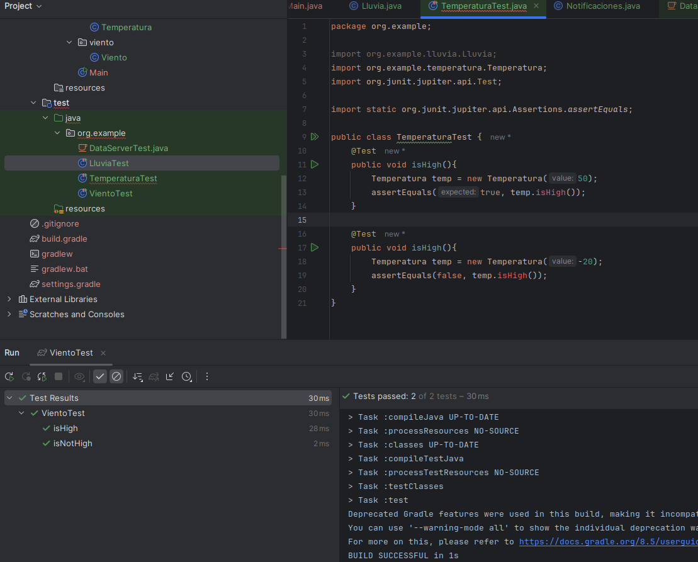

Para Lluvia:

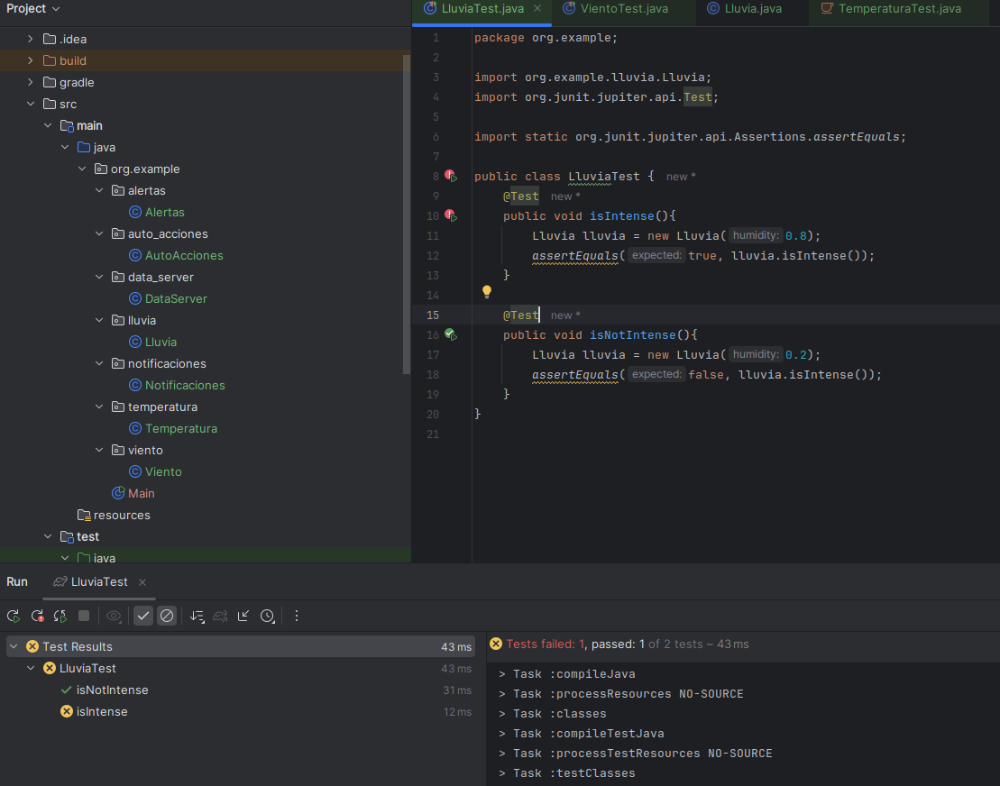

Para Viento:

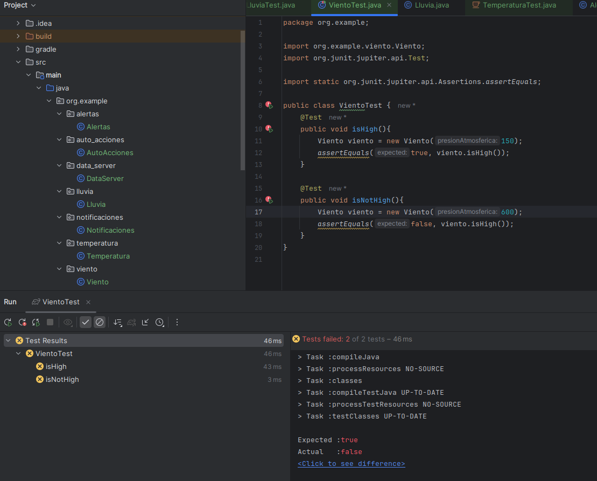

- Refactorizar el código después de que las pruebas pasen para mantenerlo limpio.

Para Temperatura:

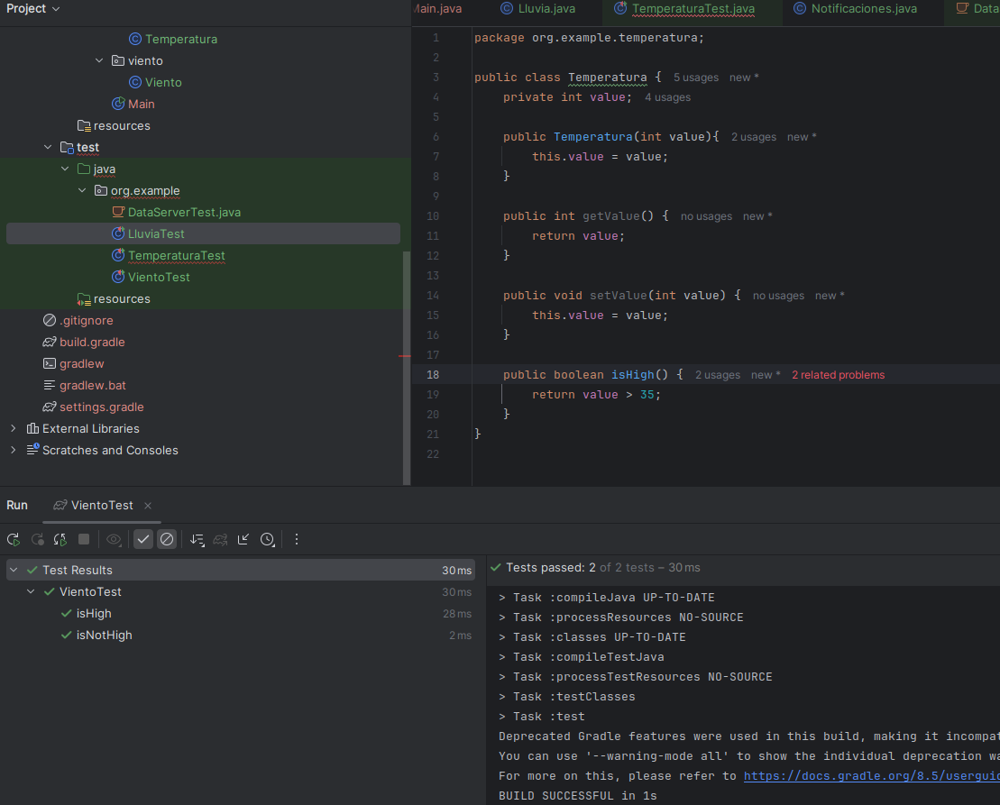

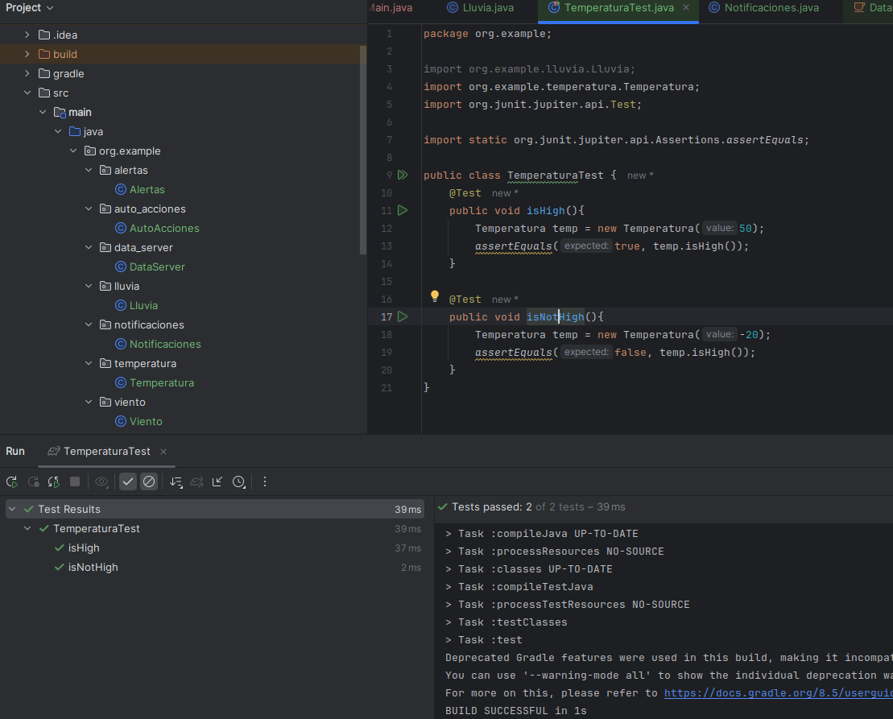

Para Lluvia:

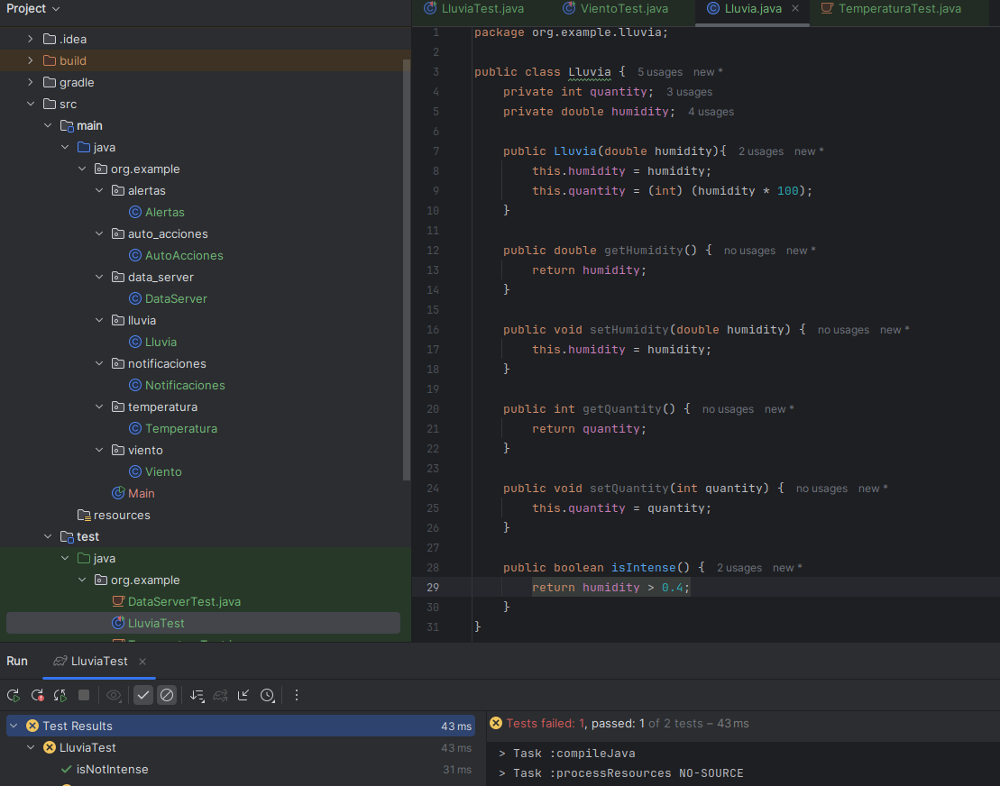

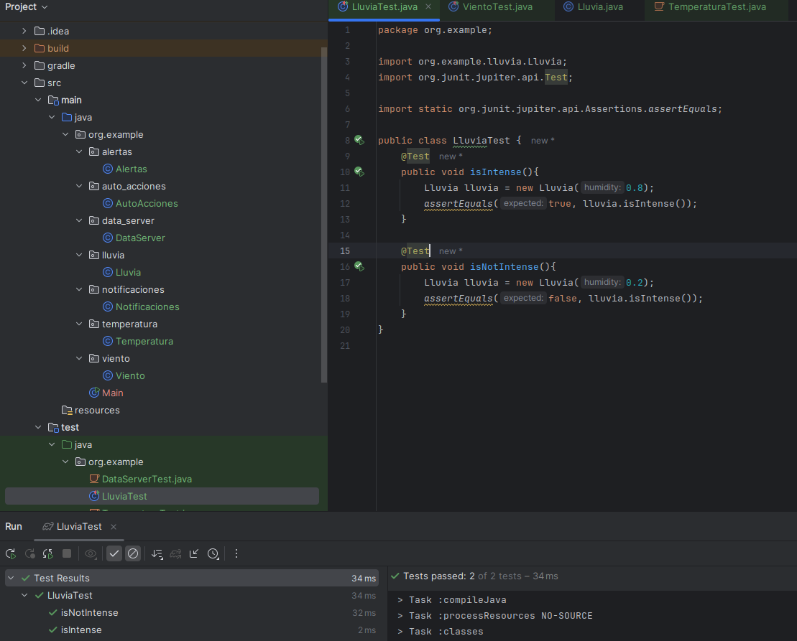

Para Viento:

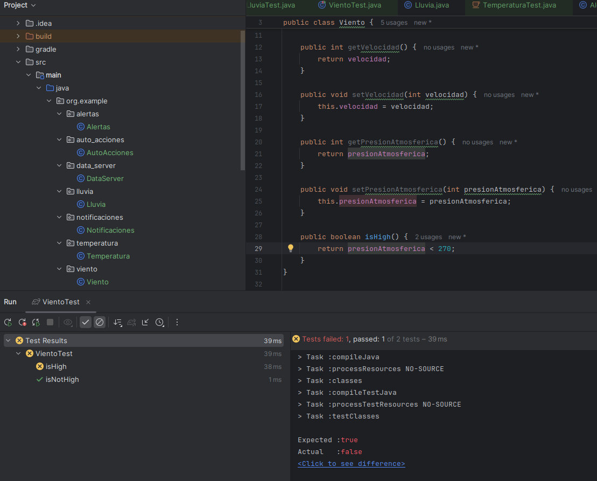

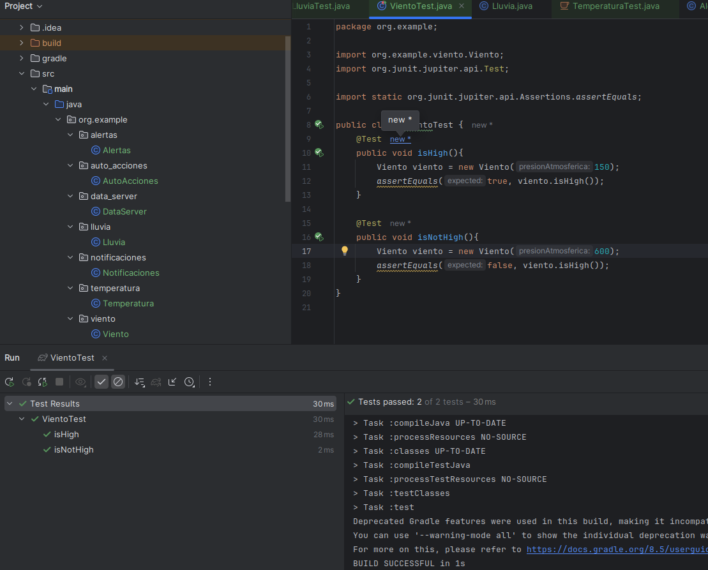

3. Validación de pruebas con stubs y fakes:
- Crear stubs para simular las condiciones climáticas

- Implementar fakes para simular escenarios de prueba más complejos

4. Refactorización y código limpio:
- Refactorizar el código regularmente para mejorar la legibilidad y mantenibilidad.

- Aplicar principios de diseño limpio y patrones de diseño adecuados.

5. Métricas de calidad:
- Utilizar herramientas para medir la cobertura de pruebas (Jacoco)

- Evaluar la complejidad del código utilizando métricas como la complejidad ciclomática.

Se puede ver que la complejidad ciclomatica aqui el maximo es de 7 el cual lo tiene la clase Lluvia y la clase Viento.

## Segundo Sprint: Uso de docker y mejora de la estrategia de pruebas (12 puntos)

1. Contenerización del Sistema:
- Crear un Dockerfile para construir la imagen de la aplicación.

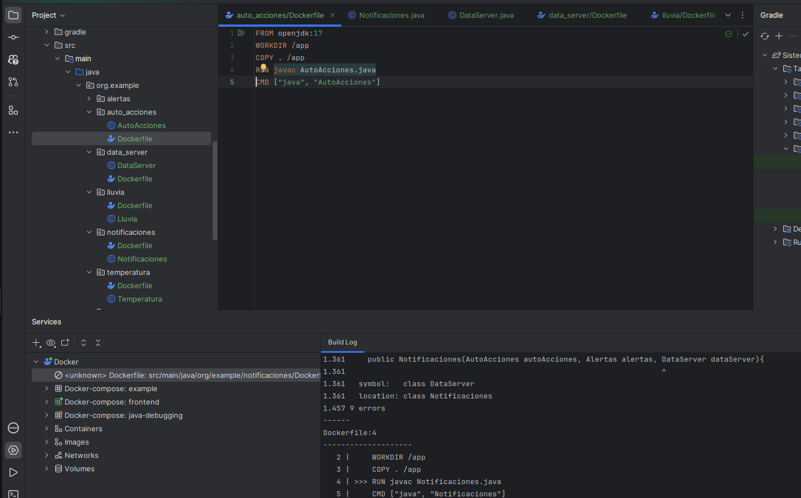

- Configurar un docker-compose.yml si se necesitan múltiples servicios (bases de
datos, servicios de simulación de clima).

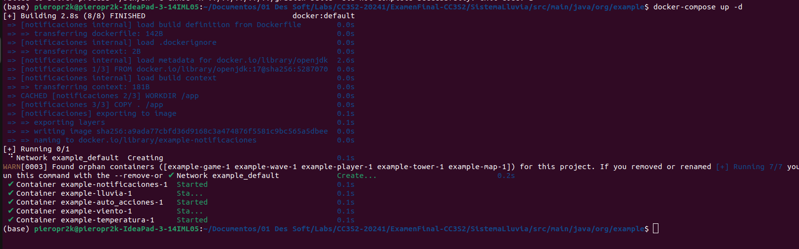

2. Refinamiento del TDD:
- Escribir nuevas pruebas para cualquier funcionalidad adicional.
- Asegurar que todas las pruebas existentes pasen en el entorno Dockerizado.

3. Mejora de la estrategia de pruebas:
- Integrar las pruebas unitarias y de integración en el pipeline de Docker.
- Asegurar que los stubs y fakes funcionen correctamente en el entorno
contenerizado.

4. Refactorización y código limpio:
- Continuar refactorizando el código para mejorar la calidad y mantener la adherencia a los principios de diseño limpio.

5. Métricas de Calidad:
- Monitorear la cobertura de pruebas y la complejidad del código en el entorno
Dockerizado.

- Utilizar herramientas de análisis de código para asegurar la calidad.

