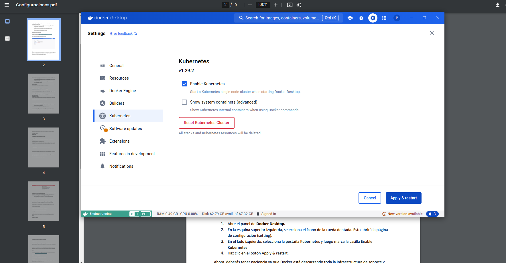
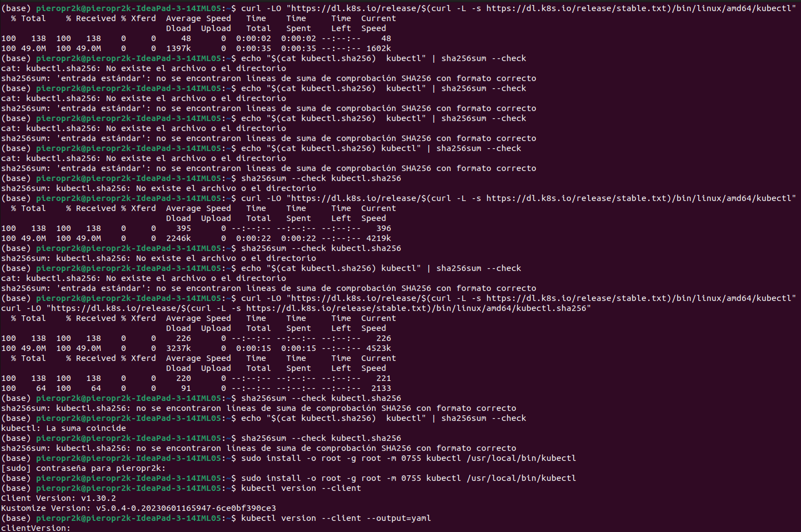
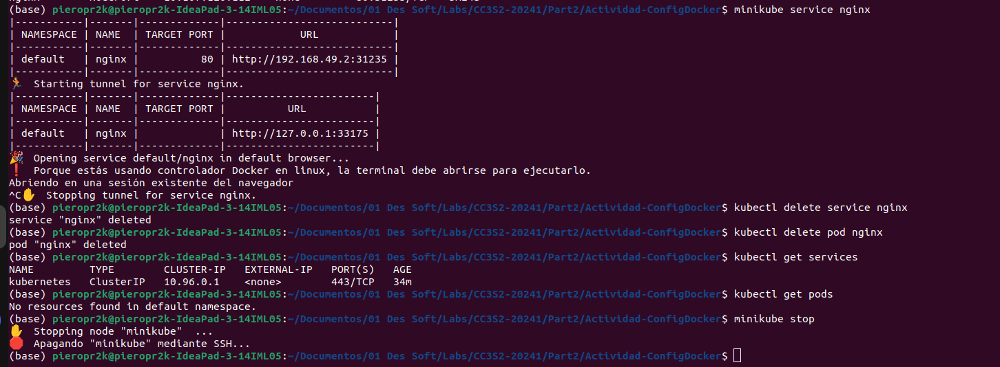
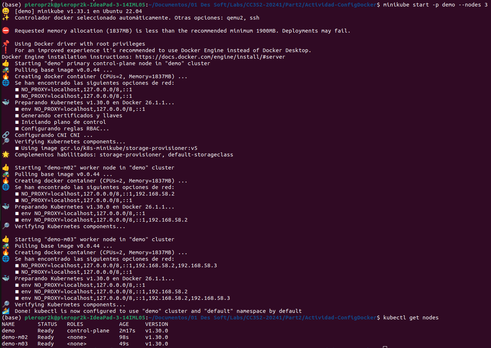
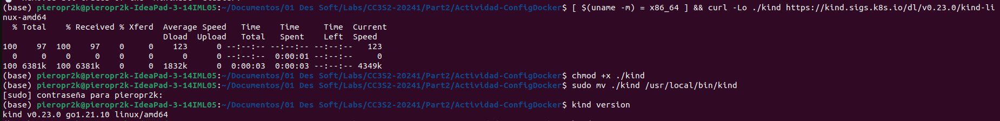
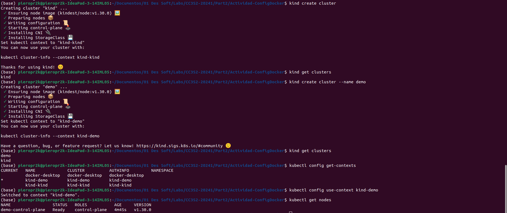
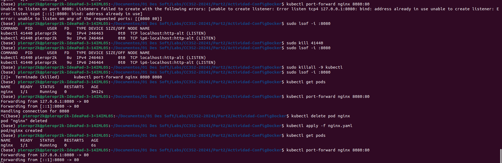

# Actividad Configuracion Docker

## Prueba de Docker Engine

En este caso mi computadora ya lo tenia instalado el Docker Desktop y Docker en general.

Para que se pueda ejecutar estos comandos sin error

```
docker version
docker container run hello-world
docker container run rancher/cowsay Hello
```

Se tiene que inicializar el Docker Desktop.


Hay que crearse un grupo para no tener la necesidad de poner sudo a todos los comandos:


Puse el comando *newgrp docker* para activar los cambios en los grupos: 


## Kubernetes

1. Abre el panel de Docker Desktop.


2. En la esquina superior izquierda, selecciona el ícono de la rueda dentada. Esto abrirá la página de configuración (setting).

3. En el lado izquierdo, selecciona la pestaña Kubernetes y luego marca la casilla Enable Kubernetes


4. Haz clic en el botón Apply & restart


## Probando minikube y kubectl

Instalamos kubectl:



Instalamos minikube e iniciamos el cluster por defecto:


1. Intenta acceder al clúster usando kubectl. Primero, debes asegurarte de tener seleccionado el
contexto correcto para kubectl. Si anteriormente instalastes Docker Desktop y ahora minikube, puedes
usar el siguiente comando:

`kubectl config get-contexts`

El asterisco al lado del contexto (verifica esto) llamado minikube te dice que este es el contexto actual.
Así, al usar kubectl, se trabajará con el nuevo cluster creado por minikube.
2. Ahora veamos cuántos nodos tiene tu cluster con este comando:

`kubectl get nodes`


3. Ahora, intenta ejecutar algo en este clúster. Usaremos Nginx, un servidor web popular para esto.
Utiliza el archivo .yaml, que acompaña a la actividad que vas a utilizar para esta prueba:

Este archivo .yaml viene cuando instalas kubectl.

Abre una nueva ventana de Terminal y crea un pod que ejecute Nginx con el siguiente comando:

`kubectl apply -f nginx.yaml`


5. Para acceder al servidor Nginx, necesitas exponer la aplicación que se ejecuta en el pod con el
siguiente comando:

`kubectl expose pod nginx --type=NodePort --port=80`

Esta es la única forma en que puedes acceder a Nginx desde tu computadora, por ejemplo, a través de
un navegador. Con el comando anterior, estás creando un servicio de Kubernetes, como se indica en el
resultado generado para el comando:

service/nginx exposed


7. Ahora, puedes usar minikube para crear un túnel hacia el clúster y abrir un navegador con la URL
correcta para acceder al servidor web Nginx. Utiliza este comando:

`minikube service nginx`

El resultado en tu ventana de terminal será el siguiente:


El resultado anterior muestra que minikube creó un túnel para el servicio nginx que escucha en el puerto
del nodo 30432 que está en nuestra computadora portátil. 

Has ejecutado y accedido con éxito a un servidor web Nginx en un clúster de Kubernetes de un solo
nodo en minikube! Una vez que hayas terminado de jugar, es hora de limpiar:

- Detén el túnel hacia el clúster presionando Ctrl + C dentro de la ventana de Terminal.
- Elimina el servicio nginx y el pod en el clúster:
```
kubectl delete service nginx
kubectl delete pod nginx
```

- Detén el clúster con el siguiente comando: 

`minikube stop`



### Ejercicios
A veces, probar con un clúster de un solo nodo no es suficiente. minikube lo resuelve. Sigue estas
instrucciones para crear un verdadero clúster de Kubernetes de múltiples nodos en minikube:
1. Si quieres trabajar con un clúster que consta de varios nodos en minikube, podemos usar este
comando:

`minikube start -p demo --nodes 3`


El comando anterior crea un clúster con tres nodos y lo llamas demo.
2. Utiliza kubectl para enumerar todos los nodos de tu clúster:

`kubectl get`



Tenemos un clúster de 3 nodos donde el nodo demo es un nodo maestro y los dos nodos restantes son
nodos de trabajo.
3. No vamos a continuar con este ejemplo aquí, así que usa el siguiente comando para detener el
clúster:

`$ minikube stop -p demo`
4. Elimina todos los clústeres de su sistema con este comando:

`$ minikube delete`


Esto eliminará el clúster predeterminado (llamado minikube) y el clúster demo en nuestro caso.
Con esto, pasaremos a la siguiente herramienta interesante y útil a la hora de trabajar con contenedores
y Kubernetes. Deberías tenerlo instalado y disponible en la computadora de tu trabajo.

## Kind
Kind (https://kind.sigs.k8s.io/docs/user/quick-start) es otra herramienta popular que se puede utilizar
para ejecutar un clúster de Kubernetes de múltiples nodos localmente en tu máquina. Es muy fácil de
instalar y usar.
Vamos:
1. En una máquina Linux, puedes usar el siguiente script para instalar Kind desde sus archivos binarios:
```
curl -Lo ./kind https://kind.sigs.k8s.io/dl/v0.22.0/kind-linux-amd64
$chmod +x ./kind
$sudo mv ./kind /usr/local/bin/kind
```
2. Una vez instalado Kind, pruébalo con el siguiente comando:

`kind version`



3. Ahora, intenta crear un clúster de Kubernetes simple que consta de un nodo maestro y dos nodos
trabajadores. Utiliza este comando para lograr esto:

`kind create cluster`

4. Para verificar que se ha creado un clúster, utiliza este comando:

`kind get clusters`

5. Podemos crear un clúster adicional con un nombre diferente usando el parámetro --name, así:

`kind create cluster --name demo`

6. Enumera los clústeres

`kind get clusters`

Ahora podemos usar kubectl para acceder y trabajar con los clústeres que acabamos de crear. Mientras
creaba un clúster, Kind también actualizó el archivo de configuración del kubectl. Podemos verificar esto
con el siguiente comando:

`kubectl config get-contexts`
Puedes ver que los clústeres kind y de demo son parte de la lista de clústeres conocidos y que el clúster
de demo es el contexto actual para kubectl (comprueba).
7. Utiliza el siguiente comando para convertir el clúster de demo en tu clúster actual si el asterisco indica
que hay otro clúster actual:
`kubectl config use-context kind-demo`

8. Enumera todos los nodos del clúster de muestra:
`kubectl get nodes`



4. Ahora, intenta ejecutar el primer contenedor en este clúster. Usa el servidor web Nginx de confianza,
como hicistes antes. Utiliza el siguiente comando para ejecutarlo:
`kubectl apply -f nginx.yaml`

El resultado debería ser el siguiente:
pod/nginx created
5. Para acceder al servidor Nginx, necesitas realizar el reenvío de puertos usando kubectl. Utiliza este
comando para hacerlo:
`kubectl port-forward nginx 8080 80 (puedes usar otros puertos)`

Revisa: kubectl describe pod nginx, https://www.kristhecodingunicorn.com/post/kubernetes-portforwarding-cleanup-of-orphaned-ports/

Abra una nueva pestaña del navegador y navega hasta http://localhost:8080; Deberías ver la pantalla de
bienvenida de Nginx.




Una vez que hayas terminado de jugar con Nginx, usa este comando para eliminar el pod del clúster:

`kubectl delete -f nginx.yaml`

Antes de continuar, limpiemos y eliminemos los dos clústeres que acabamos de crear:
```
kind delete cluster --name kind
kind delete cluster --name demo
```


Con esto, has instalado todas las herramientas que necesitaremos para trabajar exitosamente con
contenedores en tu máquina local.


Con base en lo que se cubrió en esta actividad, responde las siguientes preguntas:
1. En tus propias palabras, usando analogías, explica qué es un contenedor.


2. ¿Por qué se considera que los contenedores cambian las reglas del juego en IT? Menciona tres o cuatro razones.


3. ¿Qué significa cuando afirmamos que, si un contenedor se ejecuta en una plataforma
determinada, entonces se ejecutará en cualquier lugar? Menciona dos o tres razones por las que
esto es cierto.


4. ¿Es verdadera o falsa la siguiente afirmación: los contenedores Docker solo son útiles para
aplicaciones modernas y totalmente nuevas basadas en microservicios? Por favor justifica tu
respuesta.


5. ¿Por qué nos importaría instalar y usar un administrador de paquetes en nuestra computadora
local?


6. ¿Con Docker Desktop, puede desarrollar y ejecutar contenedores de Linux?


7. ¿Por qué son esenciales buenas habilidades de programación (como Bash o PowerShell) para el
uso productivo de los contenedores?


8. Nombra tres o cuatro distribuciones de Linux en las que Docker esté certificado para ejecutarse.


9. Instalaste minikube en tu sistema. ¿Para qué tipo de tareas utilizarás esta herramienta?


