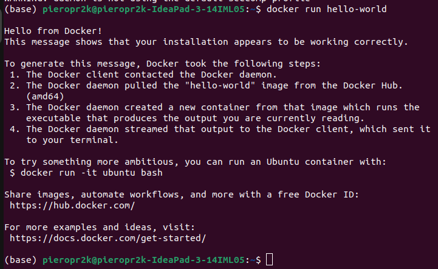

# Actividad Configuracion Docker

## Prueba de Docker Engine

En este caso mi computadora ya lo tenia instalado el Docker Desktop y Docker en general.

Para que se pueda ejecutar estos comandos sin error

```
docker version
docker container run hello-world
docker container run rancher/cowsay Hello
```

Se tiene que inicializar el Docker Desktop.


Hay que crearse un grupo para no tener la necesidad de poner sudo a todos los comandos:


- Pregunta 1: Explica el procedimiento realizado en esta ejecución por línea de comandos.

Al poner este comando sale esto, debido a que ya hemos ejecutado este codigo en la actividad anterior.

[](img/helloworld.png)


En el segundo caso, podemos realizar la siguiente operación:

*$ docker search mongo*

2. Hay muchas opciones interesantes. ¿Cómo elegimos la mejor imagen? Por lo general, la más
interesante es la que no tiene ningún prefijo, ya que significa que es una imagen oficial de Docker Hub y,
por lo tanto, debe ser estable. Las imágenes con prefijos no son oficiales, generalmente se mantienen
como proyectos de código abierto. En nuestro caso, la mejor opción parece ser mongo, por lo que para
ejecutar el servidor MongoDB, podemos ejecutar el siguiente comando: 


## Kubernetes

1. Abre el panel de Docker Desktop.


2. En la esquina superior izquierda, selecciona el ícono de la rueda dentada. Esto abrirá la página de configuración (setting).


3. En el lado izquierdo, selecciona la pestaña Kubernetes y luego marca la casilla Enable Kubernetes


4. Haz clic en el botón Apply & restart


## Probando minikube y kubectl

Instalamos kubectl:


Instalamos minikube e iniciamos el cluster por defecto:


Con base en lo que se cubrió en esta actividad, responde las siguientes preguntas:
1. En tus propias palabras, usando analogías, explica qué es un contenedor.


2. ¿Por qué se considera que los contenedores cambian las reglas del juego en IT? Menciona tres o cuatro razones.


3. ¿Qué significa cuando afirmamos que, si un contenedor se ejecuta en una plataforma
determinada, entonces se ejecutará en cualquier lugar? Menciona dos o tres razones por las que
esto es cierto.


4. ¿Es verdadera o falsa la siguiente afirmación: los contenedores Docker solo son útiles para
aplicaciones modernas y totalmente nuevas basadas en microservicios? Por favor justifica tu
respuesta.


5. ¿Por qué nos importaría instalar y usar un administrador de paquetes en nuestra computadora
local?


6. ¿Con Docker Desktop, puede desarrollar y ejecutar contenedores de Linux?


7. ¿Por qué son esenciales buenas habilidades de programación (como Bash o PowerShell) para el
uso productivo de los contenedores?


8. Nombra tres o cuatro distribuciones de Linux en las que Docker esté certificado para ejecutarse.


9. Instalaste minikube en tu sistema. ¿Para qué tipo de tareas utilizarás esta herramienta?


