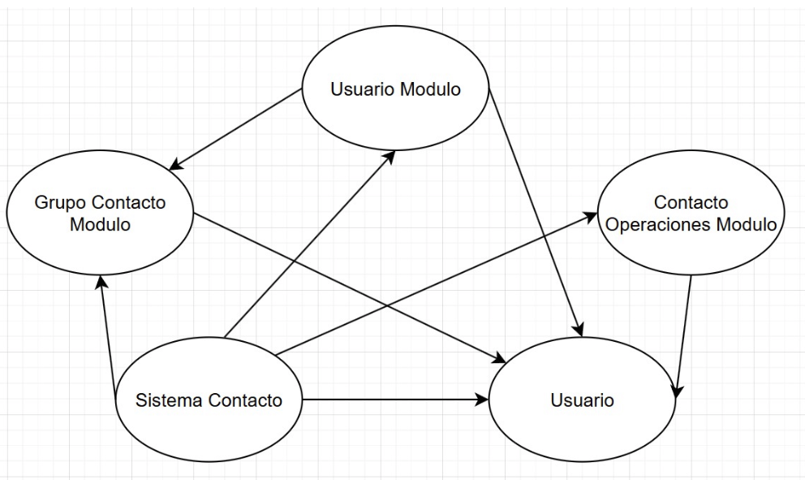

# Actividad Metricas de Calidad de Software

## Ejercicio: Analiza el Acoplamiento y realiza el cálculo del factor de acoplamiento (CF)

## Acoplamiento eferente

Clase UsuarioModulo (2)

- `Usuario` : instancia del objeto Usuario
- `agregarUsuario()` : metodo que utiliza la clase Usuario

Clase Grupo Contacto Modulo (2)

- `Usuario` : Utiliza una lista de objetos de la clase Usuario
- `agregarUsuarioAGrupo()` : metodo que tiene como parametro la clase Usuario

Clase Contacto Operaciones Modulo (2)

- `enviarMensaje()`: usa un objeto de la clase Usuario como parametro

Clase Sistema Contactos (3)

- `usuarioModulo` : instancia de la clase Usuario Modulo
- `usuario` : instancia de la clase Usuario
- `operacionesModulo` : instancia de la clase Contacto Operaciones Modulo

## Acoplamiento aferente

Clase UsuarioModulo ()

- `Usuario (Modulo)` : instancia usada en la clase Sistema Contactos

Clase Grupo Contacto Modulo

- `agregarUsuarioAGrupo()` :  metodo usado en la clase UsuarioModulo
- `crearGrupo` : metodo utilizado en la clase Sistema Contactos

Clase Contacto Operaciones Modulo

- `operacionesModulo`: instancia utilizada en la clase Sistema Contactos

Clase Usuario

- Hay 6 modulos que utilizan instancias del tipo Usuario

## Factor de Acoplamiento

`CF = e / (a*(n-1)) `

Donde

- Numero total de conexiones (e) = 8
- Numero de modulos en el sistema (a) = 5
- Numero total de modulos = 5 -> [UsuarioModulo, GrupoContactoModulo, ContactoOperacionesModulo, Usuario, SistemaContactos]

Por lo tanto `CF = 0.4`
