# Actividad: TowerDefense V3

Creamos un Dockerfile para cada microservicio:

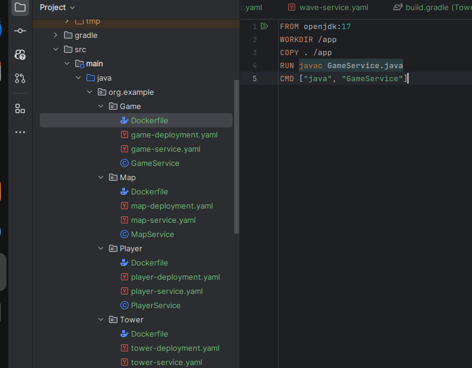

Corremos todos los Dockerfiles para obtener las imagenes:

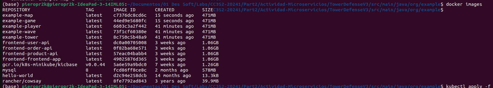

Estos son todos los contenedores generados:

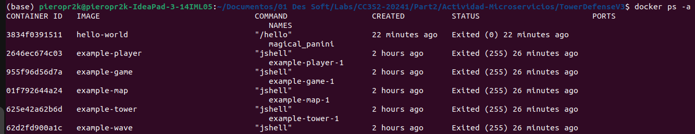

### Configuración de Pitest en Gradle
Para configurar Pitest en un proyecto Gradle, necesitas agregar las dependencias y el plugin de Pitest a
tu archivo build.gradle.

Pasos:

1. Agregar el plugin de Pitest

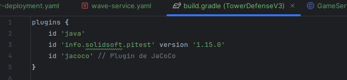

2. Configurar las dependencias

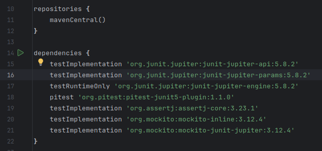

3. Configurar el plugin de Pitest:

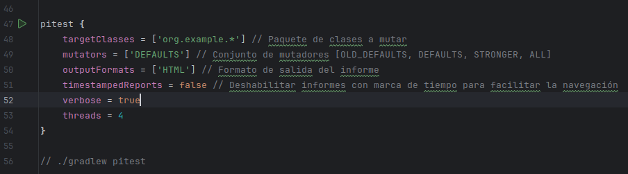

### Paso a paso para completar el proyecto

1. Preparación del entorno:

- Instalar Docker, Docker Compose y Minikube (o un clúster Kubernetes equivalente).

Se instalo en anteriores actividades

2. Desarrollar los microservicios:

- Crear los archivos Java para cada microservicio (GameService, MapService, PlayerService, TowerService, WaveService).

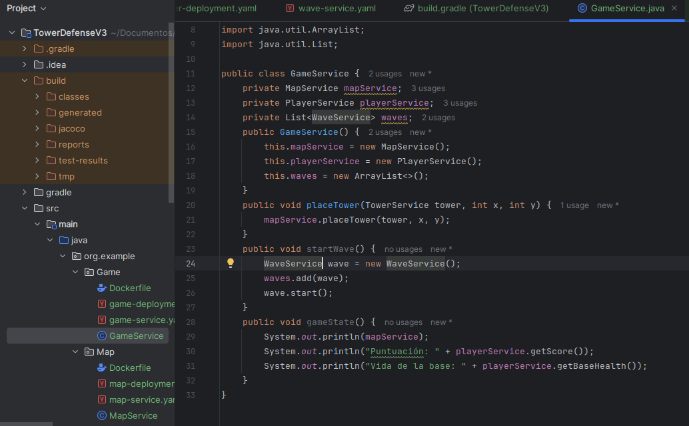

Asi creamos los archivos en GameService, MapService, PlayerService, TowerService y WaveService.

3. Configurar Docker:

- Crear un Dockerfile para cada microservicio.

Asi creamos los Dockerfile's para Game, Map, Player, Tower y Wave.

- Construir las imágenes Docker usando el comando docker build.

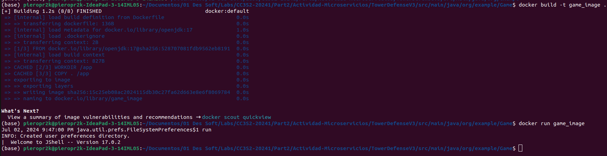

Asi creamos los imagenes para Game, Map, Player, Tower y Wave.

4. Configurar Docker Compose:

- Crear un archivo docker-compose.yml para definir cómo los contenedores interactuarán entre sí.

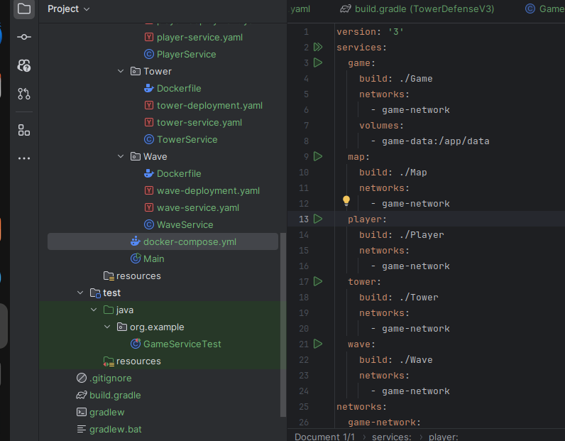

- Levantar los servicios definidos en Docker Compose usando docker-compose up.

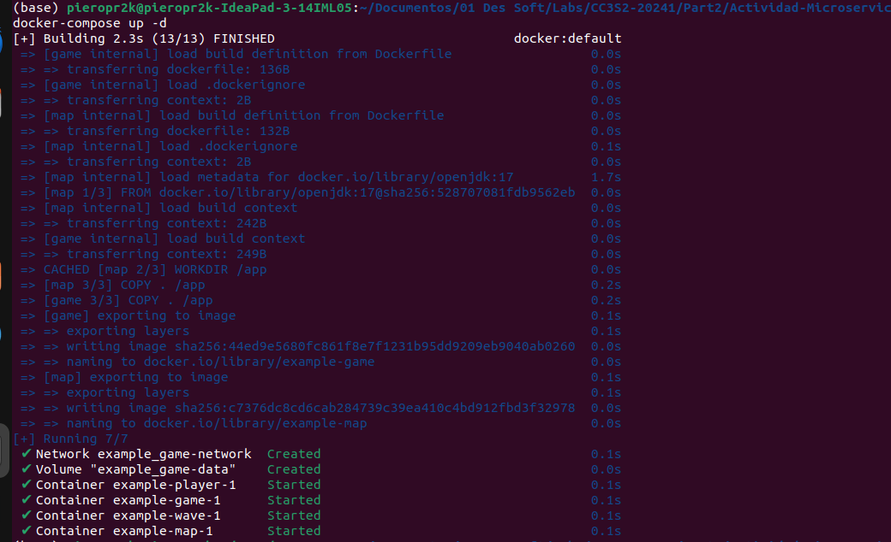

5. Desplegar en Kubernetes:

- Crear archivos de despliegue (deployment.yaml) y servicio (service.yaml) para cada
microservicio.

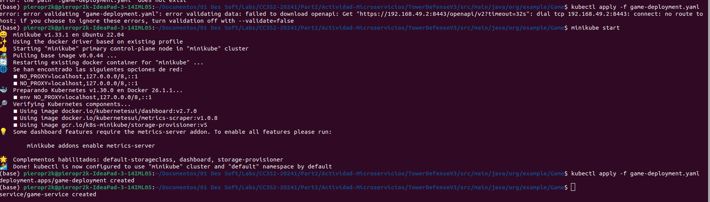

Asi hacemos para Game, Map, Player, Tower y Wave.

- Aplicar las configuraciones de Kubernetes usando kubectl apply.

6. Verificar despliegue:

- Usar comandos kubectl para verificar que los pods y servicios estén funcionando
correctamente (kubectl get pods, kubectl get services).

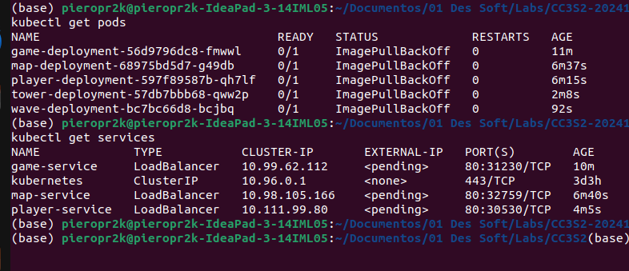

7. Implementar pruebas:

- Escribir pruebas unitarias e integración usando Mockito.

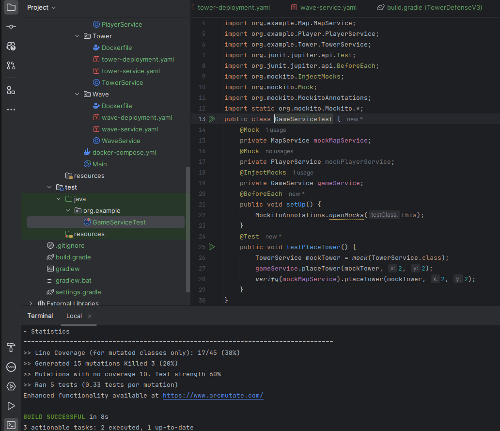

- Configurar y ejecutar pruebas de mutación para asegurar la robustez del código

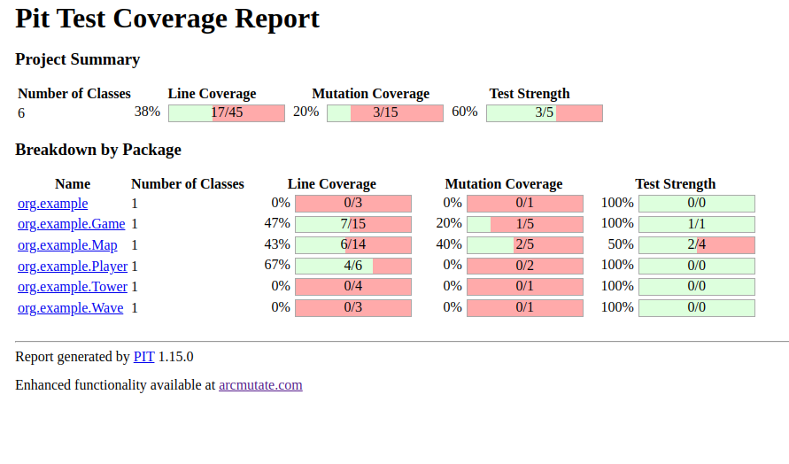

