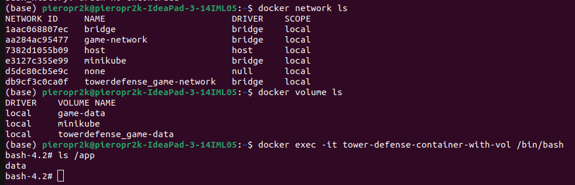
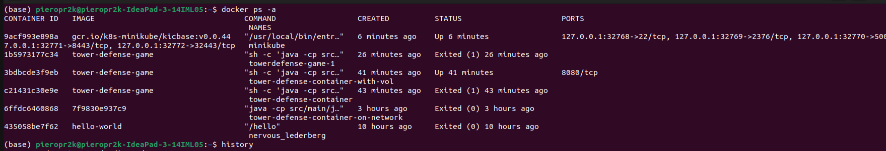

# Actividad: Mockito


### Configuración de docker

Dockerfile:

```
FROM openjdk:17-oraclelinux7
WORKDIR /usr/src/myapp
COPY . /usr/src/myapp
RUN javac src/main/java/org/example/*.java
EXPOSE 8080
CMD ["sh", "-c", "java -cp src/main/java org.example.TowerDefenseGame && exec bash"]
```

Construcción de la imagen Docker

`docker build -t tower-defense-game .`

Ejecución del contenedor:

`docker run -it --name tower-defense-container tower-defense-game`


### Configurar redes y volúmenes en Docker
Creamos una red personalizada

`docker network create game-network`

Ejecucion del contenedor en la red

`docker run -it --name tower-defense-container-on-network --network game-network tower-defense-game`


### Crear y montar un Volumen

`docker volume create game-data`

Se crea un contenedor tower-defense-container-with-vol y se conecta a la nueva red game-network.
Luego se monta el volumen game-data en este contenedor en la ubicacion /data usando la imagen tower-defense-game previamente creada.

```
docker run -d -it --name tower-defense-container-with-vol 
--network game-network -v game-data:/app/data tower-defense-game
```

**OJO**: tienes que poner -d para que el contenedor se corra en segundo plano, ya que `docker exec` requiere que el contenedor a ejecutar este en funcionamento y corriendo.

## Interacción con contenedores usando docker exec
Acceder al contenedor en ejecución

`docker exec -it tower-defense-container /bin/bash`

Al ejecutar `ls /app` se ve que bota la ubicacion del volumen:

Imagen de todo lo realizado:




Contenedores:



### Implementación con Docker Compose
Crear un archivo docker-compose.yml:

```
## El espaciado de sangria siempre es 2
version: '3'
services:
  game:
    image: tower-defense-game
    networks:
      - game-network
    volumes:
      - game-data:/app/data

networks:
  game-network:
    driver: bridge

volumes:
  game-data:
    driver: local
```

Iniciar los servicios
docker-compose up -d

### Despliegue en Kubernetes
Crear archivos de despliegue y servicio deployment.yaml

```
## El espaciado de sangria siempre es 2
version: '3'
services:
  game:
    image: tower-defense-game
    networks:
      - game-network
    volumes:
      - game-data:/app/data

networks:
  game-network:
    driver: bridge

volumes:
  game-data:
    driver: local
```

service.yaml:

```
## El espaciado de sangria siempre es 2
version: '3'
services:
  game:
    image: tower-defense-game
    networks:
      - game-network
    volumes:
      - game-data:/app/data

networks:
  game-network:
    driver: bridge

volumes:
  game-data:
    driver: local
```

Aplicar los archivos de configuración en Kubernetes
kubectl apply -f deployment.yaml
kubectl apply -f service.yaml
Verificar el estado del despliegue
kubectl get pods
kubectl get services


... continuara
