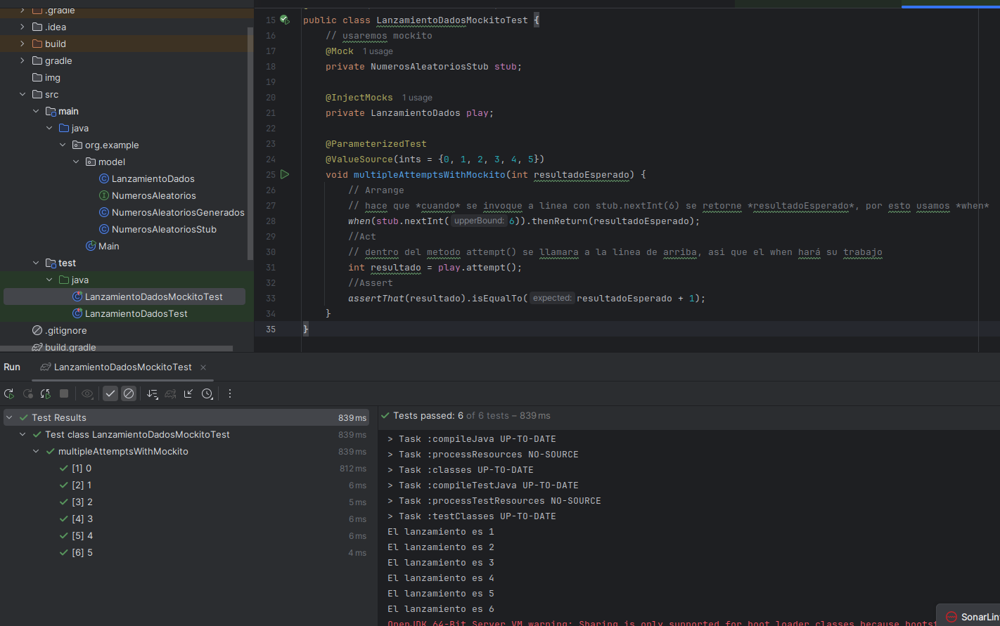
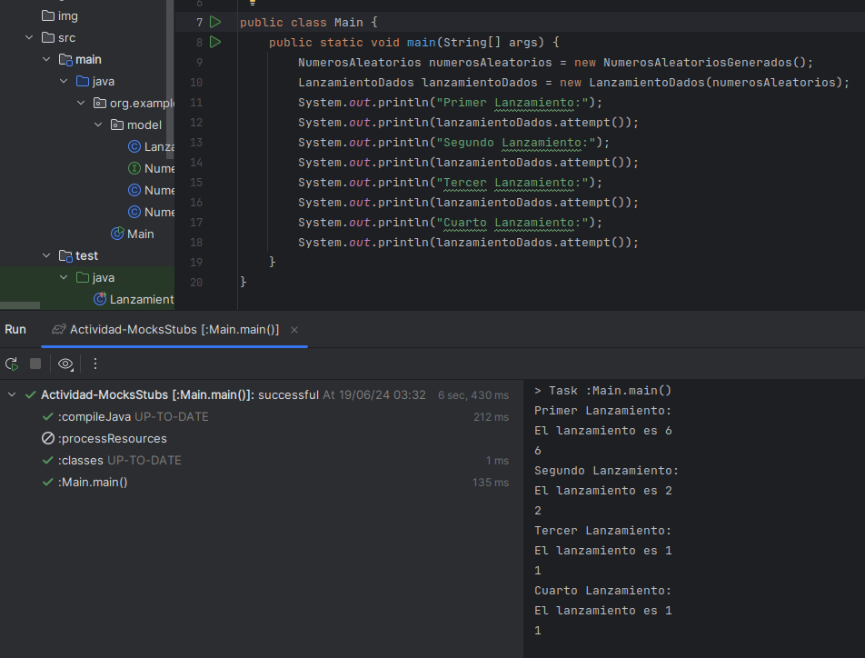

# Actividad Mocks y Stubs

## Ejercicio 1: Simulador de lanzamiento de dados

#### Paso 1

Crear una interfaz NumerosAleatorios que defina un método para obtener números
aleatorios dentro de un rango específico.

```java
// Paso 1: Crear una interfaz dados.NumerosAleatorios que defina un método para obtener números
//aleatorios dentro de un rango específico.

public interface NumerosAleatorios {
    int nextInt(int upperBoundExclusive);
}
```

#### Paso 2

Modificar la clase LanzamientoDados para que utilice la interfaz NumerosAleatorios,
inyectando la dependencia a través del constructor.

```java
// Paso 2: Modificar la clase LanzamientoDados para que utilice la interfaz NumerosAleatorios,
// inyectando la dependencia a través del constructor.

public class LanzamientoDados {
    private final int NUMERO_LADOS = 6;
    private final NumerosAleatorios rnd;

    public LanzamientoDados(NumerosAleatorios numerosAleatorios) {
        this.rnd = numerosAleatorios;
    }

    public int lanzar() {
        return rnd.nextInt(NUMERO_LADOS) + 1;
    }
}

```

#### Paso 3:
Desarrollar un stub de NumerosAleatorios para usar en pruebas unitarias, permitiendo controlar los resultados de los lanzamientos.

```java
public class LanzamientoDadosTest {
    @Test
    void produceMensaje(){
        // Arrange
        StubNumerosAleatorios stub = new StubNumerosAleatorios();
        int nextIntBound = 3;
        stub.setNextInt(nextIntBound);
        // Act
        LanzamientoDados play = new LanzamientoDados(stub);
        int attempt = play.attempt();
        // Assert
        assertThat(attempt).isEqualTo(nextIntBound+1);
    }
}
```
Creamos el stub de la clase `NumeroAleatorios`:
```java
/*
Paso 3: Desarrollar un stub de NumerosAleatorios para usar en pruebas unitarias, permitiendo
controlar los resultados de los lanzamientos.
* */
// Creamos el stub
public class StubNumerosAleatorios implements NumerosAleatorios{
    int result;

    public void setNextInt(int newValue){
        this.result = newValue;
    }

    @Override
    public int nextInt(int upperBound) {
        return this.result;
    }
}
```


Explicación:

Desarrollamos un stub de la interfaz `NumerosAleatorios` para usar en nuestras pruebas unitarias. Este stub nos permite controlar los resultados de los lanzamientos de los dados, lo que es esencial para verificar que nuestro código funcione correctamente. En el método `lanzarDados`, creamos una instancia de `NumerosAleatoriosStub`, establecemos el resultado de `nextInt` en 5, y verificamos que el resultado del lanzamiento de los dados sea 6.

#### Paso 4: 
Escribir pruebas unitarias para LanzamientoDados utilizando el stub para asegurar que la lógica del lanzamiento funciona como se espera bajo condiciones controladas.

```java
@ParameterizedTest
@ValueSource(ints = {0, 1, 2, 3, 4, 5})
void lanzarDadosConDiferentesResultados(int resultadoEsperado) {
    // Arrange
    StubNumerosAleatorios stub = new StubNumerosAleatorios();
    stub.setNextInt(resultadoEsperado);
    LanzamientoDados play = new LanzamientoDados(stub);
    // Act
    int resultado = play.attempt();
    // Assert
    assertThat(resultado).isEqualTo(resultadoEsperado + 1);
}
```

Explicación:

Para escribir pruebas unitarias para `LanzamientoDados`, utilizamos el stub que desarrollamos en el paso anterior. Utilizamos una prueba parametrizada para probar diferentes resultados posibles de los lanzamientos de dados. En cada prueba, establecemos el resultado de `nextInt` en el valor del resultado esperado, lanzamos los dados, y verificamos que el resultado sea el resultado esperado más uno. 

Tambien podemos usar Mockito:

```java
package dados;

import org.junit.jupiter.api.Test;
import org.junit.jupiter.api.extension.ExtendWith;
import org.junit.jupiter.params.ParameterizedTest;
import org.junit.jupiter.params.provider.ValueSource;
import org.mockito.InjectMocks;
import org.mockito.Mock;
import org.mockito.junit.jupiter.MockitoExtension;

import static org.assertj.core.api.Assertions.assertThat;
import static org.mockito.Mockito.when;

/*
Paso 3: Desarrollar un stub de NumerosAleatorios para usar en pruebas unitarias, permitiendo
controlar los resultados de los lanzamientos.
* */

@ExtendWith(MockitoExtension.class)
public class LanzamientoDadosMockitoTest {
    // usaremos mockito
    @Mock
    private NumerosAleatoriosStub stub;

    @InjectMocks
    private LanzamientoDados play;

    @ParameterizedTest
    @ValueSource(ints = {0, 1, 2, 3, 4, 5})
    void multipleAttemptsWithMockito(int resultadoEsperado) {
        // Arrange
        // hace que *cuando* se invoque a linea con stub.nextInt(6) se retorne *resultadoEsperado*, por esto usamos *when*
        when(stub.nextInt(6)).thenReturn(resultadoEsperado);
        //Act
        // dentro del metodo attempt() se llamara a la linea de arriba, asi que el when hará su trabajo
        int resultado = play.attempt();
        //Assert
        assertThat(resultado).isEqualTo(resultadoEsperado + 1);
    }
}
```
Se usa @Mock para inicializar el mock y @InjectMocks para inyectar el mock al objeto LanzamientoDados.

Una vez realizado esto dentro de *multipleAttemptsWithMockito()*, 
llamamos a *when()* de Mockito el cual actua **cuando** se invoca a linea con stub.nextInt(6) 
y hace que se retorne *resultadoEsperado* al invocar esta linea,
dentro del metodo attempt() se llamara a la linea `stub.nextInt(6)`, asi que when hará su trabajo aqui.



#### Paso 5: 
Implementar una clase NumerosGeneradosAleatoriamente que utilice un generador de números aleatorios real y que cumpla con la interfaz NumerosAleatorios.

```java
public class NumerosAleatoriosAleatoriamente implements NumerosAleatorios{
    private final Random rnd = new Random();
    @Override
    public int nextInt(int upperBound) {
        return rnd.nextInt(upperBound);
    }
}
```
#### Paso 6
Integrar y probar la clase LanzamientoDados en una aplicación de producción, inyectando la implementación real de NumerosAleatorios.

```java
/*
 Paso 6: Integrar y probar la clase LanzamientoDados en una aplicación de producción,
inyectando la implementación real de NumerosAleatorios.
* */
public class Main {
    public static void main(String[] args) {
        NumerosAleatorios numerosAleatorios = new NumerosGeneradosAleatoriamente();
        LanzamientoDados lanzamientoDados = new LanzamientoDados(numerosAleatorios);
        System.out.println("Primer Lanzamiento:");
        System.out.println(lanzamientoDados.lanzar());
        System.out.println("Segundo Lanzamiento:");
        System.out.println(lanzamientoDados.lanzar());
        System.out.println("Tercer Lanzamiento:");
        System.out.println(lanzamientoDados.lanzar());
        System.out.println("Cuarto Lanzamiento:");
        System.out.println(lanzamientoDados.lanzar());
    }
}
```



## Ejercicio 2:  Sistema de notificaciones por email

