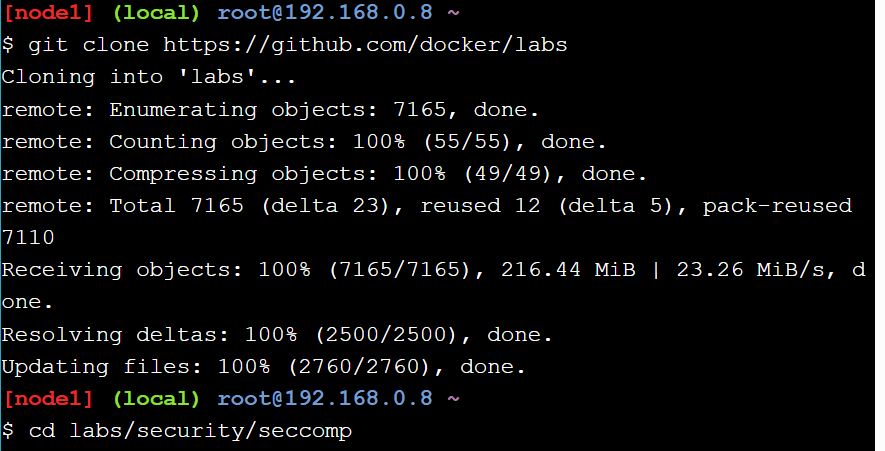

# Stage 1

# Actividad Play With Docker


# Stage 1: The Basics

En este stage veremos los fundamentos basicos de Docker

##  Your First Linux Containers

#### 1.1 Docker Images

Correremos el contenedor de Alpine Linux el cual es una distribucion de Linux ligera:
 
`docker image pull alpine`

Verificaremos con `docker image ls` que se creo:


#### 1.1 Docker Container Run

Corremos el docker container basado en su imagen (osea Alpine en este caso):

`docker container run alpine ls -l`


Hecho esto ahora podemos poner comandos en nuestro contenedor, recordar que es una distribucion de Linux:

`docker container run alpine echo "hello from alpine"`


Ya que el contenedor es una distribucion Linux, en vez de poner un solo comando por que no aprovechar en poder usar mas de uno:

`docker container run -it alpine /bin/ash`


OJO: importante poner el -it para que podamos seguir usando la consola y no se cierre automaticamente.

Ponemos estos comandos para ver la lista de contenedores:

`docker container ls -a`


-a: poner esto para ver todos los contenedores que se han corrido y ademas de los que actualmente siguen corriendo.

#### 1.2 Container Isolation

Usamos el contenedor como linea de comandos otra vez y creamos un archivo de texto `echo "hello world" > hello.txt`


Es el mismo comando ls que usamos dentro del shell ash interactivo del contenedor, pero esta vez, ¿notaste que falta el archivo “hello.txt”? ¡Eso es **aislamiento**! Su comando se ejecutó en una instancia nueva e independiente, aunque esté basada en la misma imagen. La segunda instancia no tiene forma de interactuar con la primera instancia porque Docker Engine las mantiene separadas y no hemos configurado ningún parámetro adicional que permita que estas dos instancias interactúen.


Esto es lo que paso:


Corremos el container con su id y lo comprobamos (no es necesario escribir todo su id, con unas palabras basta) 

`docker container start 2f59` 
`docker container ls`

Adicionalmente ejecutamos un comando dentro del container para listar los archivos que hay dentro y se puede ver el archivo.txt que creamos previamente esta registrado:

`docker container exec 2f59 ls`


##  Customizing Docker Images

### Image creation from a container

En esta seccion vamos a customizar nuestras imagenes de Docker

Corremos una terminal interactiva mediante un container de ubuntu 

`docker container -it ubuntu bash`


Luego instalamos el paquete figlet
```
apt-get update
apt-get install -y figlet
figlet "hello docker"
```


Ahora vamos a convertir nuestro contenedor en una imagen compartible con otros contenedores, para esto ejecutaremos este comando:
 
`docker container commit <containerID>`


Vamos a darle nombre a nuestra imagen para mayor facilidad de identificacion:

`docker image tag <imageID> <etiqueta>`


Correremos el contenedor para ver si la imagen funciona:


##  Deploy and managing multiple containers

En esta seccion aprenderemos sobre docker compose y docker swarm mode usando 2 terminales (node1-leader y node2-worker)

### Initialize Your Swarm

Inicializamos el docker swarm mode en node1 

`docker swarm init --advertise-addr $(hostname -i)`


Copiamos el comando de arriba y lo ponemos en la terminal de node2 para unirlo al swarm:

`docker swarm join --token SWMTKN-1-52fuygcfh5leifpgjumhtwkzbcby6cdmb5pb2f5mej2edt9k2f-f173aoteyylb02zcenhr3btb1 192.168.0.23:2377`


#### Show Swarm Members

Ahora verificamos que se haya agregado node2 como worker de node1: 

`docker node ls`


#### Clone the Voting App

Clonamos el sgte repositorio:


#### Deploy a Stack

Este es el archivo yaml del repo:


Hacemos deploy de la app usando el yaml 

`docker stack deploy --compose-file=docker-stack.yml voting_stack`


Con el comando `docker stack ls` se puede ver que se ha deployado

Aca podemos ver la lista de servicios del stack:


La lista de tareas del servicio voting_stack_vote


#### Scaling An Application

Escalamos la app:

`docker service scale voting_stack_vote=5`


# Stage 2

## Security Lab: Seccomp


#### Step 1: Clone the labs GitHub repo



#### Step 2: Test a seccomp profile

En este paso, utilizará el perfil seccomp deny.json incluido en el repositorio de guías de laboratorio.

Se usa el comando `docker run` para intentar iniciar un nuevo contenedor con todas las capacidades agregadas, la apariencia (apparmor) ilimitada y el perfil seccomp-profiles/deny.json seccomp aplicado.


## Security Lab: Capabilities
Antes de empezar este Laboratorio me gustaria aclarar que no soy tan bueno en seguridad, por lo
que especificare mas a detalle ciertos conceptos no tan claros para mi :).

**Empecemos:**

- root : Es el usuario que tiene todos los permisos dentro de un SO.
- Capacidad : Una capacidad nos permite dividir los privilegios del superusuario(root) en unidades mas pequeñas, es decir, 
a un usuario podemos agregarle ciertas capacidades especificas sobre el sistema sin otorgarles control total sobre el mismo.

El objetivo de este laboratorio es justamente añadir y eliminar capacidades en los contenedores. 


### Step 1: Introduction to capabilities
En este paso se aprenderá lo básico de las capacidades.

Como habiamos mencionado anteriormente se pueden desglosar los privilegios del usuario root
en unidades distintas llamadas capacidades.

Ejemplo de estos son:

- **CAP_CHOWN** : Permite al root cambiar los UIDs y GIDs de archivos arbitrariamente
- **CAP_DAC_OVERRIDE**: Permite al root omitir las verificaciones de permisos del kernel en operaciones de lectura, escritura y ejecución de archivos.

En general se entiende que cualquier permiso (accion que puede realizar un usuario sobre los recursos del sistema) es una capacidad.

Estas capacidades nos permiten reducir las capacidades individuales del usuario root, haciendo que sea menos poderoso/peligroso y Agregar permisos específicos a usuarios no-root.

Las capacidades se aplican tanto a archivos como a hilos:

- **Capacidades de archivos**: aca se brinda permiso a los usuarios de ejecutar programas con privilegios más altos.
- **Capacidades de hilos**: se mantiene el seguimiento del estado actual de capacidades en programas en ejecución.

Sin capacidades basadas en archivos, las aplicaciones no pueden aumentar sus privilegios más allá de un límite establecido. Docker define este límite antes de iniciar un contenedor y permite agregar o quitar capacidades usando comandos.

Por defecto, Docker elimina todas las capacidades excepto las necesarias, utilizando un enfoque de lista blanca.

### Step 2: Working with Docker and capabilities

Se aprenderá a gestionar las capacidades con Docker y los comandos necesarios para administrar las capacidades de la cuenta root de un contenedor.

A partir de Docker 1.12, se tiene tres opciones principales para usar capacidades:

1. Ejecutar contenedores como root con un gran conjunto de capacidades y gestionarlas manualmente dentro del contenedor. (debe evitarse)
2. Ejecutar contenedores como root con capacidades limitadas y nunca cambiarlas dentro del contenedor. (la mas realista)
3. Ejecutar contenedores como un usuario sin privilegios y sin capacidades. (opcion ideal pero no practica)

En los siguientes comandos, se utilizará $CAP para indicar una o más capacidades individuales:

Para eliminar capacidades de la cuenta root de un contenedor:

```
docker run --rm -it --cap-drop $CAP alpine sh
```

Para añadir capacidades a la cuenta root de un contenedor:

```
docker run --rm -it --cap-add $CAP alpine sh
```

Para eliminar todas las capacidades y luego añadir capacidades específicas:

```
docker run --rm -it --cap-drop ALL --cap-add $CAP alpine sh
```

Los nombres de las capacidades en Docker no llevan el prefijo "CAP_", pero coinciden con los constantes del kernel.

### Step 3: Testing Docker capabilities

En este paso se iniciará varios contenedores nuevos y se ajustarán las capacidades de la cuenta utilizada para ejecutarlos, usando los comandos aprendidos en el paso anterior.

1. Se inicia un nuevo contenedor y se prueba que la cuenta root puede cambiar la propiedad de los archivos:

```
docker run --rm -it alpine chown nobody /
```
Este comando no devuelve ningún código, indicando que la operación fue exitosa porque la cuenta root del contenedor tiene la capacidad CAP_CHOWN por defecto.

2. Se inicia otro contenedor nuevo y se elimina todas las capacidades de la cuenta root excepto la capacidad CHOWN:

```
docker run --rm -it --cap-drop ALL --cap-add CHOWN alpine chown nobody /
```

Este comando también es exitoso porque, aunque se eliminaron todas las capacidades, se agregó nuevamente la capacidad CHOWN.


3. Se inicia otro contenedor nuevo y se elimina solo la capacidad CHOWN de la cuenta root:

```bash
docker run --rm -it --cap-drop CHOWN alpine chown nobody /
```

Este comando falla y se devuelve un error indicando que la operación no está permitida, esto debido a que la cuenta root no tiene la capacidad CHOWN.

4. Creamos otro contenedor nuevo e intentamos agregar la capacidad CHOWN al usuario no-root llamado nobody y cambiar la propiedad de un archivo o carpeta:

```bash
docker run --rm -it --cap-add chown -u nobody alpine chown nobody /
```
Este comando falla, esto debido a que Docker aún no soporta agregar capacidades a usuarios no-root.


### Step 4: Extra for experts

Se aprenderá a usar herramientas adicionales para gestionar capacidades desde la shell de Linux. Existen dos principales conjuntos de herramientas:

**libcap:** se enfoca en manipular capacidades.

Comandos:
- capsh: realiza pruebas y depuración limitada de capacidades.
- setcap: establece bits de capacidad en un archivo.
- getcap: obtiene los bits de capacidad de un archivo.

**libcap-ng:** tiene herramientas útiles para auditorías.

Comandos:
- pscap: lista las capacidades de procesos en ejecución.
- filecap: lista las capacidades de archivos.
- captest: prueba y lista las capacidades del proceso actual.

#### Listando todas las capacidades

El siguiente comando inicia un nuevo contenedor usando Alpine Linux, instala el paquete libcap y luego lista las capacidades:


#### Experimentar con capacidades
El comando capsh es útil para experimentar con capacidades. Usar capsh --help muestra cómo usar el comando:


## Docker Networking Hands-on Lab


### Section #1 - Networking Basics

Step 1: The Docker Network Command

Este comando es el principal para configurar y gestionar redes de contenedores:

```
docker network
```


Step 2: List networks

Este comando sirve para ver las redes de contenedores existentes en nuestro Docker host actual;

```bash
docker network ls 
```


**Step 3: Inspect a network**

Este comando sirve para ver de manera mas detallada la configuracion de una red especifica:

```bash
docker network inspect <nombre_red>
```

En este caso la red es Bridge


**Step 4: List network driver plugins**

Este comando nos muestra la informacion de la instalacion de Docker:

```bash
docker info 
```

Tanto la version del Docker instalado:


Como otros datos del servidor como contenedores y etc:


### Section #2 - Bridge Networking

#### Step 1: The Basics

Verificamos si la red creada previamente esta:

```
docker network ls 
```


Este resultado indica que la red bridge tiene alcance local: osea que solo existe en este host de Docker. Y esto es porque se aplica a todas las redes que utilizan el driver `bridge`.

Todas las redes creadas por el drive bridge se basan en un puente de Linux.

Instalaremos el comando brctl y lo usaremos para enumerar los puentes de Linux en nuestro host Docker.


Aca se pueden ver todos los bridges-puentes Linux en el host Docker:


El resultado anterior muestra un único puente-bridge de Linux llamado docker0. Este es el puente que se creó automáticamente para la red de puentes. Se puede ver que actualmente no tiene interfaces conectadas.

También puede utilizar el comando ip a para ver los detalles del puente docker0:


#### Step 2: Connect a container

La red bridge, por defecto se conecta a los contenedores cuando no especificamos una red.

La red puente es la red predeterminada para nuevos contenedores. Esto significa que los contenedores nuevos se conectarán a la red puente por defecto, a menos que especifique una red diferente.


Este comando creará un nuevo contenedor basado en la imagen ubuntu:latest y ejecutará el comando sleep para mantener el contenedor ejecutándose en segundo plano.


## Docker Orchestration Hands-on Lab

### Section 1: What is Orchestration

La orquestación automatiza la implementación, gestión y escalado de aplicaciones en varias máquinas para garantizar alta disponibilidad y fiabilidad. 

Por ejemplo, si una aplicación necesita ser altamente disponible, podría desplegarse en al menos tres máquinas. Sin orquestación, esta implementación implica acceder manualmente a cada máquina, iniciar la aplicación y monitorearla continuamente. Ademas que se tendria que estar al pendiente de que ningun servidor se caiga. Asi que la orquestacion cumple con hacer este trabajo de manera automatica.

En el caso de Docker, Docker Swarm y Compose tienen el proposito de facilitarnos todo esto ya que simplifican y mejoran significativamente el proceso de implementación a comparación con usar solo *docker run* netamente.

### Section 2: Configure Swarm Mode

En la sección 2, se configura el modo Swarm, una funcionalidad de Docker que permite desplegar aplicaciones en múltiples hosts de manera automatizada y escalable. 

En lugar de ejecutar contenedores manualmente en un solo nodo, como se muestra con docker run -dt ubuntu sleep infinity.

```
docker run -dt ubuntu sleep infinity
```


Este comando creará un nuevo contenedor basado en la imagen ubuntu:latest y ejecutará el comando de suspensión para mantener el contenedor ejecutándose en segundo plano.

```
docker ps
```


Para evitar hacer esto configuraremos el modo Swarm el cual tiene como funcionalidad crear un grupo autogestionado de motores Docker, conocido como un "swarm". Este swarm puede incluir nodos administradores y nodos trabajadores, donde los administradores mantienen el estado del swarm y programan los contenedores de aplicación, mientras que los nodos trabajadores ejecutan dichos contenedores.

Se configura el modo Swarm para habilitar características como servicios y bundles, que simplifican el despliegue y gestión de aplicaciones multicontenedor en múltiples hosts de Docker.

- Se ejecuta una aplicación de ejemplo.
- Se escala la aplicación para adaptarse a las necesidades de carga.
- Se demuestra cómo manejar el mantenimiento de nodos y reprogramar contenedores para mantener la disponibilidad del servicio.

El modo Swarm de Docker elimina la necesidad de componentes externos o de terceros para operar un cluster completamente funcional, facilitando así la gestión de aplicaciones distribuidas de manera robusta y eficiente.


#### Step 2.1 - Create a Manager node

Crearemos un nodo manager en node1:

```bash 
docker swarm init --advertise-addr $(hostname -i)
```


Veamos que, en efecto, el nodo1 es un nodo manager con el comando.

```bash 
docker info
```

Se puede ver que hay un solo nodo en node1 y es el mismo:


#### Step 2.2 - Join Worker nodes to the Swarm**

Unimos los nodos 2 y 3 al Swarm mediante el comando lanzado previamente con `docker swarm init`

```bash
 docker swarm join --token SWMTKN-1-20f908i0eo3wrasucdvdq3zgdluv7molev8w4t87j0s7ftmwso-2f91xtcw9h4sikahdqqjenu7r 192.168.0.7:2377
```


Luego en el nodo1 (nodo manager) podemos ver que existen 3 nodos, el nodo mismo y los otros 2 nodos workers que se unieron al swarm:


### Section 3: Deploy applications across multiple hosts

#### Step 3.1 - Deploy the application components as Docker services**

Usaremos el concepto de Servicios para escalar la aplicacion de manera sencilla y manejar varios contenedores como una sola entidad.

Implementemos sleep como servicio en nuestro Docker Swarm.

```bash
docker service create --name sleep-app ubuntu sleep infinity
```


Listamos los servicios ejecutandose en este nodo.


En este punto, puede parecer que no hemos hecho nada muy diferente a simplemente ejecutar una ventana acoplable.... Nuevamente hemos implementado un solo contenedor en un solo host. La diferencia aquí es que el contenedor se programó en un clúster Swarm.

### Section 4: Scale the application

Una de las ventajas de los servicios es que se pueden ampliar o reducir para satisfacer la demanda. En este paso, ampliará el servicio y luego lo reducirá.

Veamos ahora que tenemos corriendo una unica replica de nuestro contenedor con el siguiente comando.

Se puede escalar y hacer que la aplicacion tenga 7 replicas con el siguiente comando:

```
docker service update --replicas 7 sleep-app
```


Usaremos este comando para ver todos los servicios de sleep-app:

`docker service ps sleep-app`

Es muy extenso para imagen:

```
ID             NAME              IMAGE           NODE      DESIRED STATE  CURRENT STATE             ERROR                            PORTS
jmtesappt3ek   sleep-app.1       ubuntu:latest   node1     Running  Running 41 seconds ago
sbg3ri9epa1b   sleep-app.2       ubuntu:latest   node1     Running  Running 11 seconds ago
295y5wvedpz1    \_ sleep-app.2   ubuntu:latest   node3     Shutdown  Rejected 21 seconds ago   "No such image: ubuntu:latest"
aet6gugb9bmn    \_ sleep-app.2   ubuntu:latest   node3     Shutdown  Rejected 26 seconds ago   "No such image: ubuntu:latest"
qqm7ylrgx89g    \_ sleep-app.2   ubuntu:latest   node3     Shutdown  Rejected 27 seconds ago   "No such image: ubuntu:latest"
rfytywd886br   sleep-app.3       ubuntu:latest   node1     Running  Running 15 seconds ago
vnwgzasi6l4c    \_ sleep-app.3   ubuntu:latest   node2     Shutdown  Rejected 25 seconds ago   "No such image: ubuntu:latest"
tu02fvjo34a2    \_ sleep-app.3   ubuntu:latest   node2     Shutdown  Rejected 27 seconds ago   "No such image: ubuntu:latest"
ktp1pjh5sq3e   sleep-app.4       ubuntu:latest   node1     Running  Running 10 seconds ago
x1onzo3nzqe0    \_ sleep-app.4   ubuntu:latest   node3     Shutdown  Rejected 21 seconds ago   "No such image: ubuntu:latest"
vsfpucrb90sm    \_ sleep-app.4   ubuntu:latest   node2     Shutdown  Rejected 25 seconds ago   "No such image: ubuntu:latest"
kbswxu2mht7s    \_ sleep-app.4   ubuntu:latest   node2     Shutdown  Rejected 27 seconds ago   "No such image: ubuntu:latest"
xaf34fxin7wy   sleep-app.5       ubuntu:latest   node1     Running  Running 26 seconds ago
6wouubsjge4a   sleep-app.6       ubuntu:latest   node1     Running  Running 11 seconds ago
r26c8mkdydwg    \_ sleep-app.6   ubuntu:latest   node3     Shutdown  Rejected 21 seconds ago   "No such image: ubuntu:latest"
vwsr5n5lvwzp    \_ sleep-app.6   ubuntu:latest   node3     Shutdown  Rejected 26 seconds ago   "No such image: ubuntu:latest"
fkutjvbva7eg    \_ sleep-app.6   ubuntu:latest   node3     Shutdown  Rejected 27 seconds ago   "No such image: ubuntu:latest"
a82vs5038ewq   sleep-app.7       ubuntu:latest   node1     Running  Running 15 seconds ago
jo2gyrn3ow3u    \_ sleep-app.7   ubuntu:latest   node2     Shutdown  Rejected 25 seconds ago   "No such image: ubuntu:latest"
73shs7ep52oa    \_ sleep-app.7   ubuntu:latest   node2     Shutdown  Rejected 27 seconds ago   "No such image: ubuntu:latest"
```

Vamos a reducir el numero de replicas de a 4 con el sgte comando:

```
docker service update --replicas 4 sleep-app
```


Ahora verificamos que justamente existen 4 replicas de la aplicacion ejecutandose...


### Section 5: Drain a node and reschedule the containers

Se deberá sacar con elegancia un servidor del Swarm sin interrumpir el servicio a los clientes.

Verificamos en el nodo manager el estado de los nodos, para esto corremos el siguiente comando:

```
docker node ls
```


Dejaremos el nodo 2 fuera de servicio por mantenimiento.

Veamos los contenedores que tienes ejecutándose en el nodo2.

```
docker ps 
```

Como podemos ver existe un contenedor con de la app sleep-app corriendo justo en este contenedor.

```
CONTAINER ID        IMAGE                                                                            COMMAND             CREATED             STATUS              PORTS               NAMES
4e7ea1154ea4        ubuntu@sha256:dd7808d8792c9841d0b460122f1acf0a2dd1f56404f8d1e56298048885e45535   "sleep infinity"    9 minutes ago       Up 9 minutes                            sleep-app.6.35t0eamu0rueeozz0pj2xaesi
```

Ahora regresamos al terminal1 (nodo1) para ver cual es el ID del nodo2 (nodo que vamos a drenar).
Ejecutamos nuevamente el comando :

```
docker node ls
```

Y en la salida podemos ver que el nodo2 tiene un ID igual a yu3h...


```
ID                           HOSTNAME  STATUS  AVAILABILITY  MANAGER STATUS
6dlewb50pj2y66q4zi3egnwbi *  node1   Ready   Active        Leader
ym6sdzrcm08s6ohqmjx9mk3dv    node3   Ready   Active
yu3hbegvwsdpy9esh9t2lr431    node2   Ready   Active
```

Drenaremos el nodo 2 con este comando:

mob8rqrsddg6loms33k15fhfb: es el id del nodo 2.

```
docker node update --availability drain mob8rqrsddg6loms33k15fhfb
```

Se ve que el nodo 2 esta drenado:

```
ID                           HOSTNAME  STATUS  AVAILABILITY  MANAGER STATUS
6dlewb50pj2y66q4zi3egnwbi *  node1   Ready   Active        Leader
ym6sdzrcm08s6ohqmjx9mk3dv    node3   Ready   Active
mob8rqrsddg6loms33k15fhfb    node2   Ready   Drain
```

Ahora vamos al terminal de nodo2 y ejecutamos este comando para ver que contenedores estan corriendo:

```bash
docker ps
```

Podemos ver que no hay ningun contenedor corriendo en este nodo:


Nuevamente verificamos  el servicio nuevamente en el nodo1 para asegurarse de que el contenedor haya sido reprogramado. Debería ver los cuatro contenedores ejecutándose en los dos nodos restantes.

```
ID            NAME             IMAGE          NODE     DESIRED STATE  CURRENT STATE           ERROR  PORTS
7k0flfh2wpt1  sleep-app.1      ubuntu:latest  node1  Running        Running 25 minutes ago
wol6bzq7xf0v  sleep-app.2      ubuntu:latest  node3  Running        Running 18 minutes ago
s3548wki7rlk  sleep-app.6      ubuntu:latest  node3  Running        Running 3 minutes ago
35t0eamu0rue   \_ sleep-app.6  ubuntu:latest  node2  Shutdown       Shutdown 3 minutes ago
44s8d59vr4a8  sleep-app.7      ubuntu:latest  node1  Running        Running 18 minutes ago
```

### Cleaning Up

Eliminamos el servicio de sleep-app:

`docker service rm sleep-app`

Eliminamos el contenedor del nodo1 con el que iniciamos todo esto:

`docker kill container_id_node1`

En la terminal de los 3 nodos ejecutamos este comando:

`docker swarm leave --force`
