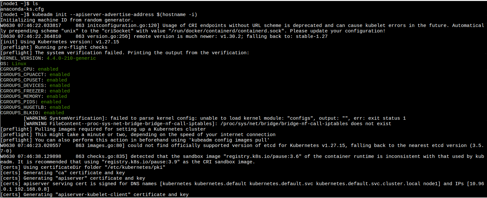
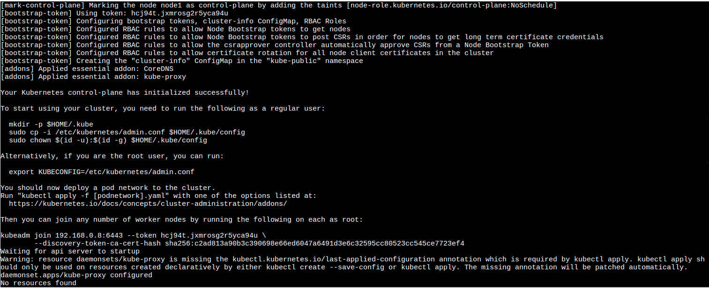
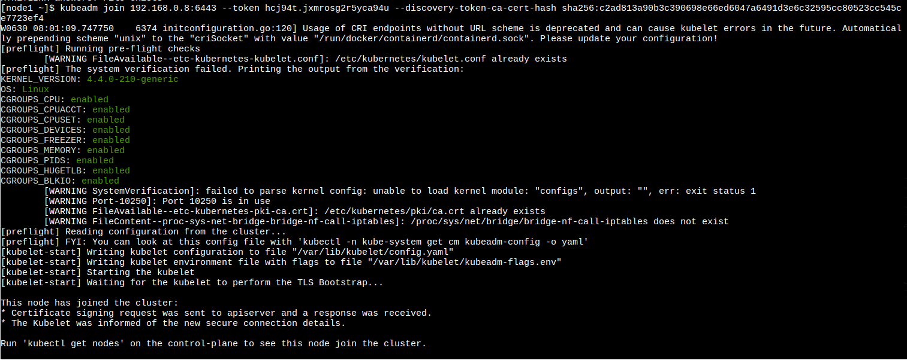
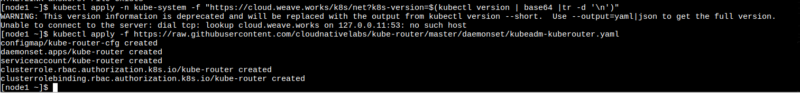

# Actividad Play With Docker

En esta actividad haremos los Stage 1 y 2 del proyecto PWD (Play with Docker), estos stages los encuentras en [Play with Docker Stages](https://training.play-with-docker.com/)

# Iniciar el cluster

Primer paso para inicializar el cluster en la terminal:

`kubeadm init --apiserver-advertise-address $(hostname -i)`

Copiamos toda la linea con el token, la direccion IP y el hash y pegamos:

`kubeadm join --token hcj94t.jxmrosg2r5yca94u 192.168.0.8:6443 --discovery-token-ca-cert-hash sha256:c2ad813a90b3c390698e66ed6047a6491d3e6c32595cc80523cc545ce7723ef4`

Esto fue lo que copiamos.

2. Ahora tienes que inicializar la red del cluster en la terminal: 

`kubectl apply -n kube-system -f "https://cloud.weave.works/k8s/net?k8s-version=$(kubectl version | base64 |tr -d '\n')"`

`kubectl apply -f https://raw.githubusercontent.com/cloudnativelabs/kube-router/master/daemonset/kubeadm-kuberouter.yaml`

# DockerCoin miner

Clonamos este repositorio:

git clone https://github.com/dockersamples/dockercoins

Para correr todos los contenedores:

docker-compose up

### First contact with kubectl

kubectl get node

3. Corremos el docker container basado en la imagen alpine `docker container run alpine ls -l`

4. Una vez hecho esto podemos ejecutar comandos dentro de nuestro container como por ejemplo decirle que nos retorne un "hello from alpine" `docker container run alpine echo "hello from alpine"`

5. Listamos todos los contenedors que hayamos corrido previamente `docker container ls -a`

6. Tambien podemos entrar a la consola del contenedor y seguir ejecutando comandos en ella aisladamente `docker container run -it alpine /bin/ash`

7. Creamos un archivo de texto `echo "hello world" > hello.txt`

8. Corremos un container con su id y lo comprobamos **(no es necesario escribir todo su id)** `docker container start 5017` `docker container ls`

9. Mandamos un comando dentro del container para listar los archivos y se observa el archivo.txt que creamos en el punto 7 `docker container exec 5017 ls`

##  Customizing Docker Images

En esta seccion vamos a customizar nuestros images para que se pueda compartir con los demas 

1. Corremos una terminal en un container de ubuntu `docker container -it ubuntu bash`

2. Instalamos el paquete figlet `apt-get update` `apt-get install -y figlet` `figlet "hello docker"`

3. Ahora convertimos nuestra contenedor con dependencias instaladas en una imagen que se pueda compartir con otros. Para hacer esto debemos obtener primero el id del container y luego hacer "comitear" este container y verificamos que se haya creaado `docker container commit <containerID>`

4. Vamos a etiquetar nuestra imagen para que sea mas amigable al momento de identificarlo `docker image tag <imageID> <etiqueta>`

5. Corremos un comando para verificar que funcione correctamente

##  Deploy and managing multiple containers

En esta seccion aprenderemos sobre docker compose y docker swarm mode usando 2 terminales (node1-leader y node2-worker)

1. Inicializamos el docker swarm mode en el node1 `docker swarm init --advertise-addr $(hostname -i)`

2. En el node2 nos unimos al swarm mode mediante el token que nos dieron `docker swarm join --token <token> 168.0.7:2377`

3. Verificamos en el node1 que se haya agregado nuestro worker `docker node ls`

4. Ahora vamos a clonar una app de votacion

5. Hacemos deploy de la app usando el archivo yaml `docker stack deploy --compose-file=docker-stack.yml voting_stack`

6. Verificamos que haya terminado correctamente `docker stack ls`\

# Stage 2: Diggin Deeper

En esta etapa aprenderemos más sobre algunos de los temas avanzados de Docker

## Java Development: Intellij + Docker

Acá aprenderemos a dockerizar un proyecto simple usando Intellij

Dependencias:

- IntelliJ + Docker Plugin
- Docker Desktop

Una vez tengamos todas las dependencias procedemos a crear nuestro archivo Dockerfile en nuestro proyecto

Donde:

- `FROM amazzoncorretto:17`: Indica la imagen que vamos a usar
- `COPY build/classes/java/main/ /wordApp`: Copia la primera ruta (ruta de nuestra clase main) en la segunda ruta (nuevo directorio)
- `CMD java org.example.Main`: Ejecuta nuestra clase main

Corremos nuestro Dockerfile

Y al ejecutar HelloWorld significa que no hubo problemas, incluso se puede observar la imagen que se instalo (amazoncorretto17)

Una vez tengamos neustro container podemos hacer que otras personas lo usen y corran nuestra aplicacion de una manera sencilla usando `docker compose`

Para lograr esto necesitamos un archivo `docker-compose.yaml`

Donde:

- `version`: Especifica la version de docker-compose
- `services`:
- `wordapp`: directorio de nuestro proyecto
- `build`: Lo necesario para hacer build del proyecto
- `context`: Ubicacion de los archivos del proyecto
- `dockerFile`: Especificacion del archivo dockerfile
- `ports`: Puerto donde se va a mostrar nuestra app

En este caso como es una app sencilla que solo muestra un HelloWorld, no es necesario un puerto

Para correr nuestro archivo docker-compose.yaml ejecutamos `docker-compose up --build`

