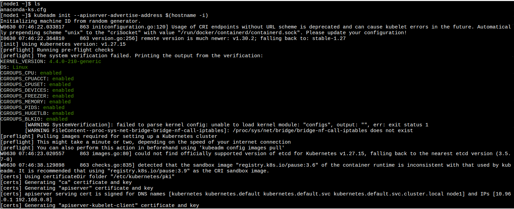
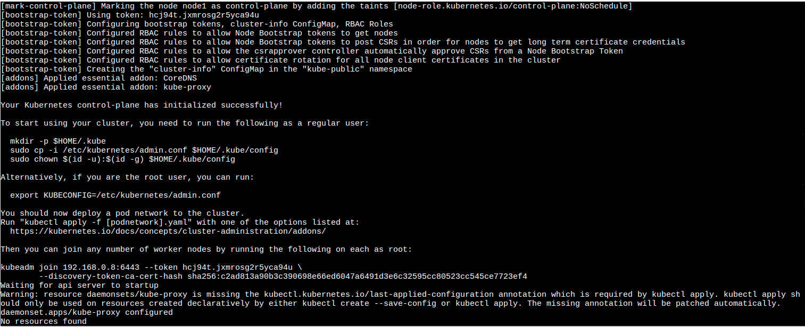
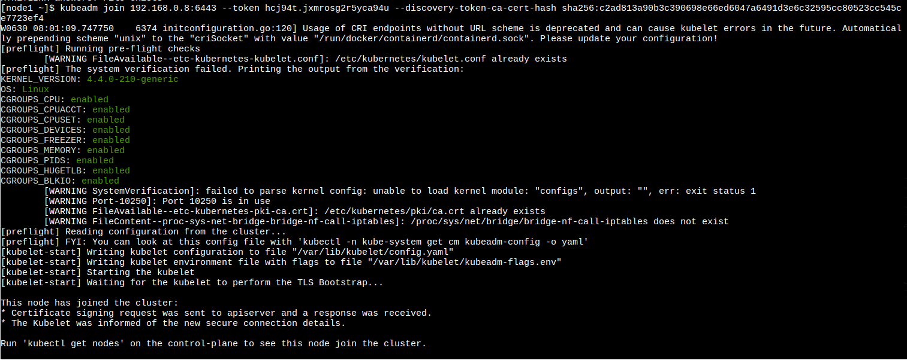
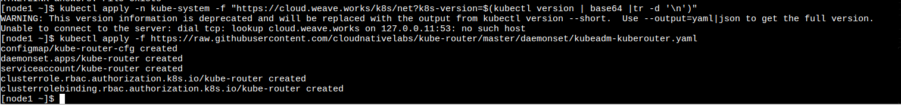
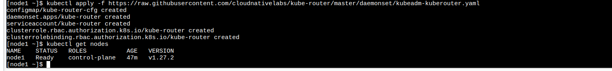

# Actividad Play With Kubernetes

# Iniciar el cluster

Primer paso para inicializar el cluster en la terminal:

`kubeadm init --apiserver-advertise-address $(hostname -i)`

Copiamos toda la linea con el token, la direccion IP y el hash y pegamos:

`kubeadm join --token hcj94t.jxmrosg2r5yca94u 192.168.0.8:6443 --discovery-token-ca-cert-hash sha256:c2ad813a90b3c390698e66ed6047a6491d3e6c32595cc80523cc545ce7723ef4`

Esto fue lo que copiamos.

2. Ahora tienes que inicializar la red del cluster en la terminal: 

`kubectl apply -f https://raw.githubusercontent.com/cloudnativelabs/kube-router/master/daemonset/kubeadm-kuberouter.yaml`

# DockerCoin miner

Clonamos este repositorio:

git clone https://github.com/dockersamples/dockercoins

Para correr todos los contenedores:

docker-compose up

### First contact with kubectl

kubectl get node

