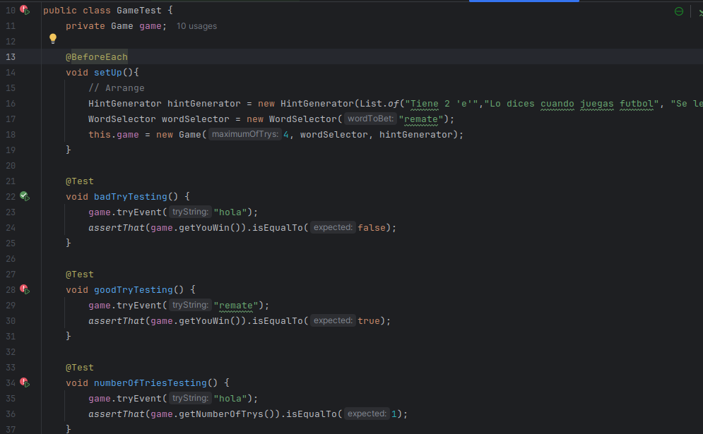
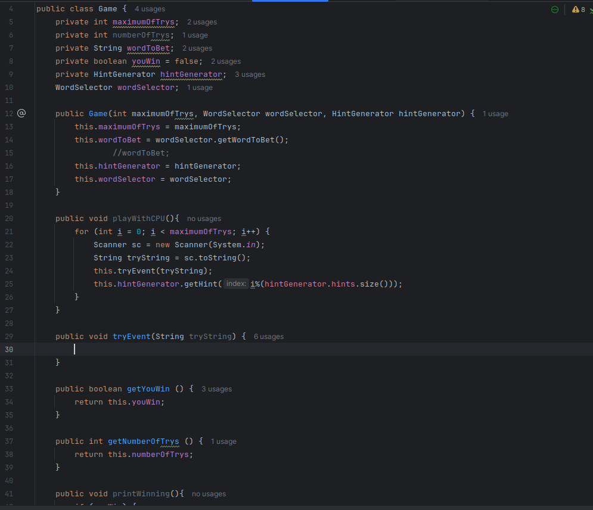
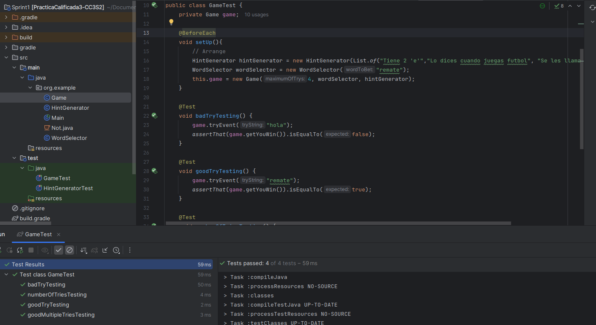
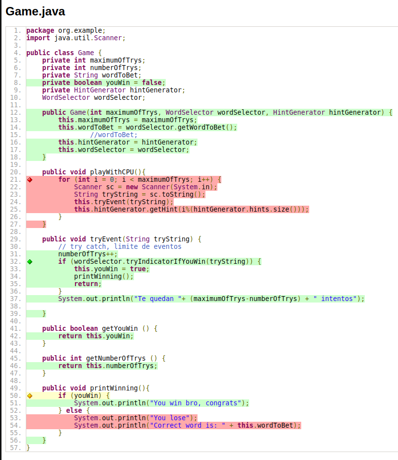
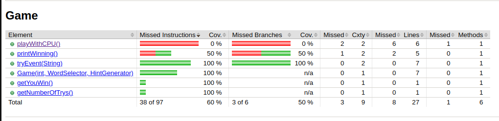
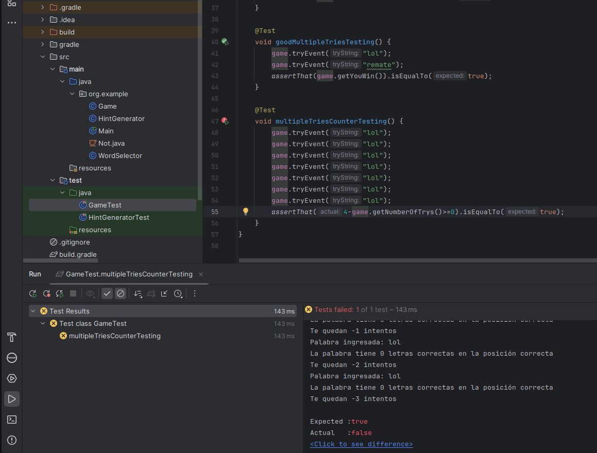

# Practica Calificada 3 - Ejercicio 3

### Descripción del juego
El videojuego será una versión de "adivina la palabra" donde el jugador debe adivinar una palabra
oculta basada en pistas dadas. Se jugará en la consola, sin interfaz gráfica. El juego proporcionará
pistas y el jugador tendrá que adivinar la palabra correcta dentro de un número limitado de intentos.

## Sprint 1: configuración básica y estructura del juego (2 puntos)

### Configuracion:
Configuración del proyecto: Crear un nuevo proyecto en Gradle y configurar dependencias para JUnit 5.
```gradle
plugins {
    id 'java'
    id 'jacoco' // Plugin de JaCoCo
}

group = 'org.example'
version = '1.0-SNAPSHOT'

repositories {
    mavenCentral()
}

dependencies {
    testImplementation platform('org.junit:junit-bom:5.10.0')
    testImplementation 'org.junit.jupiter:junit-jupiter'
    testImplementation 'org.assertj:assertj-core:3.25.3'
    testImplementation 'org.jetbrains:annotations:24.0.0'
}

test {
    useJUnitPlatform()
}

// jacoco
jacoco {
    toolVersion = "0.8.12" // Versión de JaCoCo (compatible con java 21)
}

jacocoTestReport {
    dependsOn test // Ejecuta las pruebas antes de generar el informe

    reports {
        xml.required.set(true)
        html.required.set(true)
    }
}

check.dependsOn jacocoTestCoverageVerification

// ./gradlew pitest
// ./gradlew jacocoTestReport
```

### Clases:
```java
public class Game {
    private int maximumOfTrys;
    private int numberOfTrys;
    private String wordToBet;
    private boolean youWin;
    private HintGenerator hintGenerator;
    WordSelector wordSelector;

    public Game(int maximumOfTrys, WordSelector wordSelector, HintGenerator hintGenerator) {
        this.maximumOfTrys = maximumOfTrys;
        this.wordToBet = wordSelector.getWordToBet();
                //wordToBet;
        this.hintGenerator = hintGenerator;
        this.wordSelector = wordSelector;
    }

    public void playWithCPU(){
        for (int i = 0; i < maximumOfTrys; i++) {
            Scanner sc = new Scanner(System.in);
            String tryString = sc.toString();
            this.tryEvent(tryString);
            this.hintGenerator.getHint(i%(hintGenerator.hints.size()));
        }
    }

    public void tryEvent(String tryString) {
        // try catch, limite de eventos
        numberOfTrys++;
        if (wordSelector.tryIndicatorIfYouWin(tryString)) {
            this.youWin = true;
            printWinning();
            return;
        }
        System.out.println("Te quedan "+ (maximumOfTrys-numberOfTrys) + " intentos");
    }

    public boolean getYouWin () {
        return this.youWin;
    }

    public int getNumberOfTrys () {
        return this.numberOfTrys;
    }

    public void printWinning(){
        if (youWin) {
            System.out.println("You win bro, congrats");
        } else {
            System.out.println("You lose");
            System.out.println("Correct word is: " + this.wordToBet);
        }
    }
}
```

```java
public class HintGenerator {
    List<String> hints;

    public HintGenerator(List<String> hints){
        this.hints = hints;
    }
    public String getHint(int index) {
        return hints.get(index);
    }
}
```

```java
public class WordSelector {
    private String wordToBet;

    public WordSelector(String wordToBet) {
        this.wordToBet = wordToBet;
    }

    public boolean tryIndicatorIfYouWin(String tryString) {
        System.out.println("Palabra ingresada: "+ tryString);
        if (this.wordToBet.equals(tryString)) {
            return true;
        }
        retroalimentacion(tryString);
        return false;
    }

    public void retroalimentacion(String tryString){
        int correctChars = 0;
        final char[] wordToBetCharArray = this.wordToBet.toCharArray();
        final char[] tryStringCharArray = tryString.toCharArray();
        for (int i = 0; i < wordToBetCharArray.length; i++) {
            for (int j = 0; j < tryStringCharArray.length; j++) {
                if (wordToBetCharArray[i] == tryStringCharArray[j]) {
                    correctChars++;
                    break;
                }
            }
        }
        System.out.println("La palabra tiene " + correctChars + " letras correctas en la posición correcta");
    }

    public String getWordToBet() {
        return this.wordToBet;
    }
}
```

### Refactorización y TDD: Desarrollar pruebas unitarias para cada método implementado. Refactorizar el código para mantenerlo limpio y entendible.

### TDD1

Pruebas iniciales:
```java

```


<span style="color:red;">1. RED</span>

Veamos como funciona la prueba: se esperaba CORRECT pero se obtuvo INCORRECT. Esto se debe a que tryEvent() no hace nada y esto hace que *youWin* sea **false** por defecto



<span style="color:red;">1. RED</span>

Añadiremos este codigo a tryEvent:
```java
public void tryEvent(String tryString) {
        // try catch, limite de eventos
        numberOfTrys++;
        if (wordSelector.tryIndicatorIfYouWin(tryString)) {
            this.youWin = true;
            printWinning();
            return;
        }
        System.out.println("Te quedan "+ (maximumOfTrys-numberOfTrys) + " intentos");

}
```



Ahora se puede ver que las pruebas pasan.


###Metricas de Codigo:





## Sprint 2: Lógica de juego y retroalimentación (3 puntos)

<span style="color:blue;">3. REFACTOR</span>

El codigo esta mejorable.
Si bien se ejecutaron las pruebas y pasaron, hay que hacer que el codigo sea lo mas optimo y seguro posible. En este caso pondremos un try catch para que se respete el numero de intentos
```java
public void tryEvent(String tryString) {
        try {
            // try catch, limite de eventos
            numberOfTrys++;
            if (wordSelector.tryIndicatorIfYouWin(tryString)) {
                this.youWin = true;
                printWinning();
            } else {
                System.out.println("Te quedan "+ (maximumOfTrys-numberOfTrys) + " intentos");
            }
            if (numberOfTrys > maximumOfTrys) {
                throw new IllegalArgumentException("Only able to "+ maximumOfTrys + "trys");
            }
        } catch (IllegalArgumentException exception) {
            System.out.println(exception.getMessage());
        }

    }
    
    
```
### Solución:

## TDD-2

<span style="color:blue;">1. RED</span>

Aqui se ve que la prueba esta en rojo, esto porque no se respeta el numero de intentos



Poniendo el codigo de arriba tenemos:


<span style="color:blue;">2. GREEN</span>

```java
@Test
    void constructorShouldThrowExceptionForIllegalGamesNb() {
        game.tryEvent("lol");
        game.tryEvent("lol");
        game.tryEvent("lol");
        game.tryEvent("lol");
        assertThatExceptionOfType(IllegalArgumentException.class)
                .isThrownBy(() -> {
                    game.tryEvent("lol");
                });
    }
```


## Sprint 3: Refinamiento y finalización (4 puntos)

```java

```
