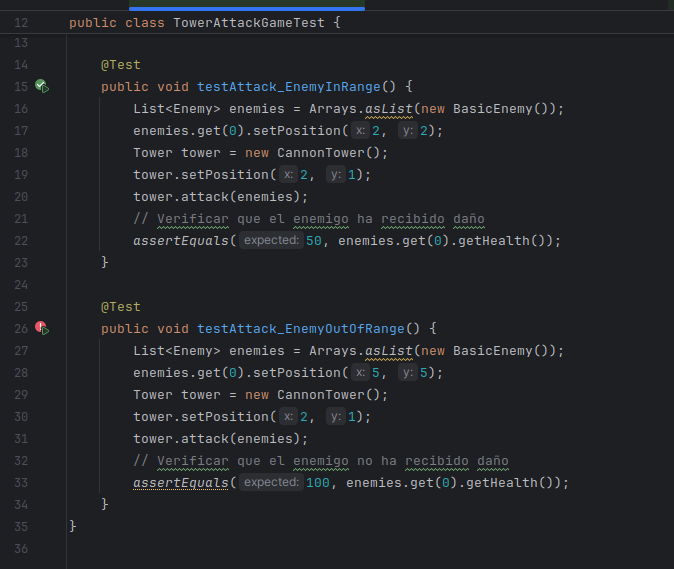

# Practica Calificada 4 - 2024-1


### Pruebas de mutación:
- Implementa pruebas de mutación para verificar la calidad de las pruebas unitarias.


- ¿Qué herramienta utilizarías para realizar pruebas de mutación en este proyecto, y cómo la
configurarías?

Usaria Pitest ya que es la mas ideal para ver los posible mutantes en las pruebas: cuales son, cuales sobreviven y mueren. 

- Configura la herramienta de pruebas de mutación para el proyecto y ejecuta un análisis de
mutación en la clase TowerDefenseGame.

### Preguntas de diseño e implementación (5 puntos)

Diseño de la clase Map:
- ¿Cómo implementarías la clase Map para representar el mapa del juego, asegurando que se
puedan agregar y verificar posiciones de torres y caminos?
- Implementa un método en la clase Map llamado isValidPosition(int x, int y) que verifique si
una posición es válida para colocar una torre.
Enemigos con diferentes características:
- Diseña e implementa una clase SpeedyEnemy que herede de Enemy y tenga una velocidad
mayor pero menos vida.
- ¿Cómo gestionarías el movimiento de los enemigos en el mapa, asegurando que sigan el
camino predefinido?
Torres con diferentes habilidades:
- Implementa una clase SniperTower que tenga un daño alto y un alcance muy largo pero una
velocidad de disparo baja.
- ¿Cómo implementarías el método attack(List<Enemy> enemies) en la clase Tower para
atacar a los enemigos dentro de su alcance?
Sistema de oleadas:
- ¿Cómo diseñarías la generación de oleadas para que cada oleada sea progresivamente más
difícil?

Le pondria una variable contador tal que en cada iteracion este va aumentando y por lo tanto la dificultad del juego tambien.

- Implementa un método en la clase Wave llamado spawnEnemies() que genere los enemigos
de la oleada y los coloque en el mapa.
Sistema de puntuación y salud de la base:
- ¿Cómo actualizarías la puntuación del jugador y la salud de la base cuando un enemigo es
derrotado o alcanza la base?

Si el enemigo es derrotado entonces se nos tendria que adicionar los puntos que corresponden dependiendo del tipo de enemigo derrotado y la salud se decrementaria en caso el enemigo nos ataca, esto depende del tipo de enemigo ya que cada tipo de estos decrementa cierto valor.

- Implementa un método en la clase Player llamado updateScoreAndHealth(Enemy enemy,
boolean defeated).


### Pruebas estructurales (3 puntos)

- Ejercicio: Implementa pruebas para garantizar que todas las ramas del método placeTower
en la clase TowerDefenseGame estén cubiertas

```
public class Tower {
    private int damage;
    private int range;
    private int fireRate; // turnos entre disparos
    private Position position;

    public Tower(int damage, int range, int fireRate) {
        this.damage = damage;
        this.range = range;
        this.fireRate = fireRate;
        this.position =  new Position(0, 0);
    }
    // Constructores, getters y setters
    public int getDamage() {
        return this.damage;
    }

    public void setDamage(int damage) {
        this.damage = damage;
    }

    public int getRange() {
        return this.range;
    }

    public void setRange(int range) {
        this.range = range;
    }

    public int getFireRate() {
        return this.fireRate;
    }

    public void setFireRate(int fireRate) {
        this.fireRate = fireRate;
    }

    public void setPosition(int x, int y) {
        position.setPosition(x, y);
    }

    public void attack(List<Enemy> enemies) {
        for (Enemy enemy: enemies){
            enemy.downHealth(damage);
        }
    }
}
```





