# Practica Calificada 5


### Configuración de docker


## Ejercicio 1: Configuración y uso de docker (3 puntos)

#### Teoría:
- Describe los principios fundamentales de los contenedores Docker y su arquitectura interna.
Explica cómo Docker maneja la seguridad y el aislamiento de contenedores.

**Rpta:**
Docker utiliza contenedores ligeros basados en la virtualización a nivel de sistema operativo, esto para garantizar portabilidad.
Docker maneja la seguridad y el aislamiento utilizando namespaces y control groups (cgroups) de Linux para separar los recursos y procesos de cada contenedor.

- Compara y contrasta Docker con soluciones de virtualización tradicionales, como VMware y VirtualBox. Discute las ventajas y desventajas de cada enfoque.

**Rpta:**
Docker es online y permite que el software que corre en la computadora de una persona corra en cuando abrimos su contenedor.
En VirtualBox se tiene que configurar todo desde cero, sin embargo en Docker ya todo esta realizado.

Docker ofrece una virtualización ligera a nivel de SO y cuenta con alta portabilidad, esto es ideal para los microservicios.
Por el otro lado en soluciones tradicionales como VMware y VirtualBox si bien puedes aislar los entornos y se cuenta con soporte para múltiples sistemas operativos, este genera un mayor consumo de recursos y también los tiempos de inicio son más lentos.

Se debe ejecutar este comando, sin embargo...

`docker exec -it tower-defense-container /bin/bash`

Si lo ejecutamos nos sale esto:

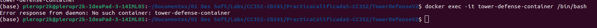

Esto es debido a que aun no se ha creado el contenedor *tower-defense-container*, asi que primero vamos a crearlo.

### Práctico:
- Escribe un Dockerfile para la aplicación Tower Defense que incluya la instalación de todas las
dependencias necesarias. Asegúrate de optimizar el Dockerfile para reducir el tamaño de la
imagen final.

#### Respuesta:

Primero creamos el Dockerfile del contenedor para que previamente se cree la imagen:

```
// Dockerfile
FROM openjdk:17-oraclelinux7
WORKDIR /usr/src/myapp
COPY . /usr/src/myapp
RUN javac src/main/java/org/example/*.java
EXPOSE 8080
CMD ["sh", "-c", "java -cp src/main/java org.example.TowerDefenseGame && exec bash"]
```

Construcción de la imagen Docker:

`docker build -t tower-defense-game .`

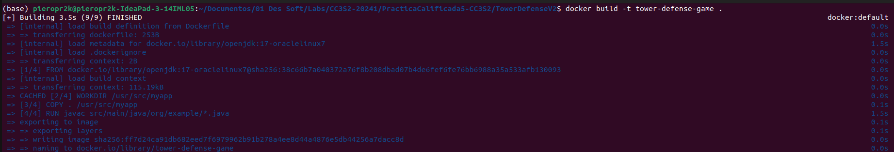

- Construye y ejecuta el contenedor Docker utilizando el Dockerfile creado. Utiliza docker exec
para acceder al contenedor y verificar que la aplicación funcione correctamente.

#### Respuesta

Hacemos la ejecución del contenedor para crearlo:

`docker run -it --name tower-defense-container tower-defense-game`

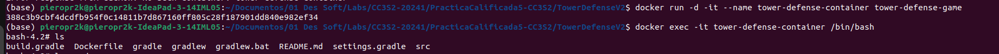

- Configura una red personalizada para la aplicación Tower Defense. Implementa múltiples
contenedores que interactúen entre sí a través de esta red personalizada.

#### Respuesta:

Primero se configura la red, en este caso ya la tenia configurada por la actividad V1:

`docker network create game-network`

Ahora implementamos multiples contenedores que sean parte de esta red:

docker run -it --name tower-defense-container-on-network1 --network game-network tower-defense-game

docker run -it --name tower-defense-container-on-network2 --network game-network tower-defense-game

docker run -it --name tower-defense-container-on-network3 --network game-network tower-defense-game

Aca se ve:

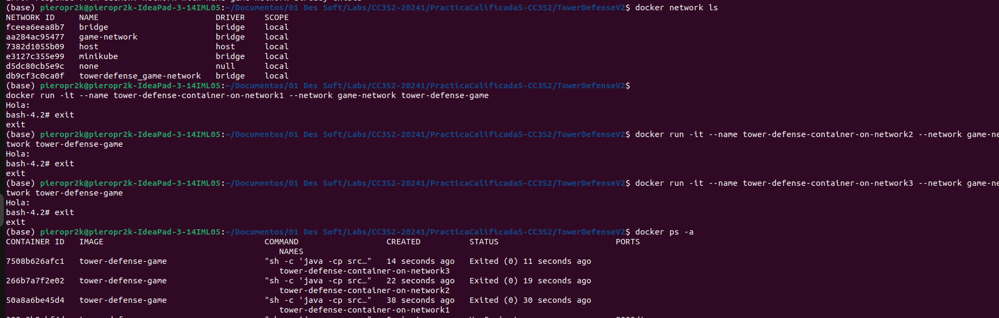


## Ejercicio 2: Redes y volúmenes en Docker (3 puntos)

#### Teoría:
- Explica en detalle cómo Docker maneja las redes y los volúmenes. 
Discute los diferentes tipos de redes (bridge, host, overlay) y cuándo es apropiado usar cada una.

**Rpta:**
Docker gestiona las redes mediante tipos como 'bridge', 'host' y 'overlay' para facilitar la comunicación entre contenedores y hosts múltiples. Los volúmenes de Docker permiten el almacenamiento persistente y compartir estos datos entre los contenedores y el host.

Tipos de redes y cuando es apropiado usarlas: 
1. Bridge (de puente): para crear redes internas donde los contenedores se comunican en un mismo host.
2. Host: para conectar contenedores directamente a la red del host, es ideal cuando los contenedores necesitan alto rendimiento en la red.
3. Overlay: para conectar múltiples máquinas Docker en una red compartida, ideal para aplicaciones distribuidas.

- Describe los mecanismos de persistencia de datos en Docker, incluyendo volúmenes y bind
mounts. Explica las diferencias entre ellos y las mejores prácticas para su uso.

#### Práctico:
- Crea una red personalizada para el proyecto Tower Defense y configura los contenedores
para que utilicen esta red.

#### Respuesta:
```
docker network create new-game-network
docker run -it --name tower-defense-container-on-network-pc5 --network new-game-network tower-defense-game
```

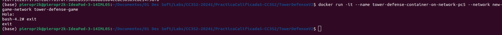

- Implementa un volumen Docker para almacenar los datos del juego de forma persistente.
Asegúrate de que el volumen se monte correctamente y que los datos persistan después de
reiniciar el contenedor.

#### Respuesta:

En este caso ponemos este comando para implementar un volumen, hay que decir que ya estaba creado por la actividad V1, asi que se mostrara la prueba:

`docker volume create game-data`

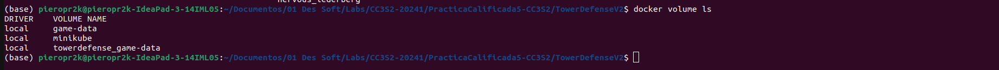

Se crea un contenedor tower-defense-container-with-vol y se conecta a la nueva red game-network.
Luego se monta el volumen game-data en este contenedor en la ubicacion /data usando la imagen tower-defense-game previamente creada.

```
docker run -d -it --name tower-defense-container-with-vol --network new-game-network -v game-data:/app/data tower-defense-game
```

**OJO**: tienes que poner -d para que el contenedor se corra en segundo plano, ya que `docker exec` requiere que el contenedor a ejecutar este en funcionamento y corriendo.

Acceder al contenedor en ejecución

`docker exec -it tower-defense-container /bin/bash`

Al ejecutar `ls /app` se ve que bota la ubicacion del volumen:

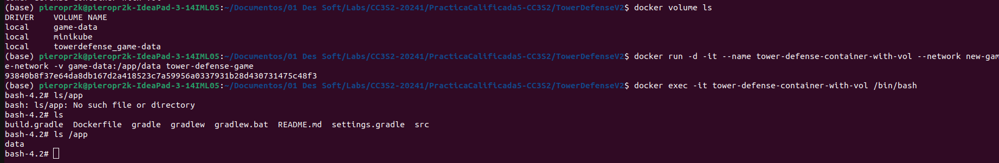

- Utiliza docker-compose para definir los servicios de la aplicación Tower Defense, incluyendo
redes y volúmenes. Escribe un archivo docker-compose.yml que configure estos servicios y
despliega la aplicación utilizando Docker Compose.

#### Respuesta:

Se crea un archivo docker-compose.yml:

```
## El espaciado de sangria siempre es 2
version: '3'
services:
  game:
    image: tower-defense-game
    networks:
      - game-network
    volumes:
      - game-data:/app/data

networks:
  game-network:
    driver: bridge

volumes:
  game-data:
    driver: local
```

Iniciar los servicios
docker-compose up -d

Todo corre bien:
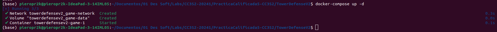

## Ejercicio 3: Orquestación con Kubernetes (4 puntos)

#### Teoría:

- Describe la arquitectura de Kubernetes y sus componentes principales, incluyendo el API
server, etcd, scheduler, y kubelet. Explica cómo estos componentes interactúan para
gestionar un clúster de Kubernetes.

**Rpta:**
Arquitectura de Kubernetes - Componentes principales:

1. API Server: Actúa como punto de entrada para la gestión del clúster, aceptando comandos y consultas de usuarios y otros componentes. Es la única interfaz para el control y la configuración del clúster.
2. etcd: Es un almacén de datos consistente y con alta disponibilidad utilizado para almacenar la configuración del clúster, el estado del objeto y los metadatos.
3. Scheduler: Componente responsable de programar contenedores en nodos del clúster, basándose en los recursos disponibles y los requisitos de las aplicaciones.
4. Kubelet: Agente que se ejecuta en cada nodo del clúster y gestiona los contenedores locales, se asegura que estén en ejecución y en el estado deseado.

La arquitectura de Kubernetes facilita la gestión eficiente y escalable de aplicaciones en clústeres distribuidos, asegurando alta disponibilidad y fiabilidad mediante la coordinación precisa de sus componentes esenciales.

- Discute las estrategias de escalabilidad y alta disponibilidad en Kubernetes. Explica cómo
Kubernetes maneja la recuperación de fallos y la gestión de réplicas.

**Rpta:**
Kubernetes escala las aplicaciones horizontalmente añadiendo o reduciendo réplicas y
verticalmente ajustando recursos como CPU y memoria.
Para alta disponibilidad, se gestiona las réplicas, se distribuyen en nodos 
y se reinicia automáticamente los pods fallidos. 
Se utiliza controladores de replicación para mantener el número deseado de réplicas y para asegurar la tolerancia a fallos y la continuidad del servicio.


#### Práctico:

- Escribe un archivo deployment.yaml para la aplicación Tower Defense. Asegúrate de definir
los recursos necesarios (CPU, memoria) y las políticas de escalabilidad.

```
apiVersion: apps/v1
kind: Deployment
metadata:
  name: tower-defense-deployment
spec:
  replicas: 1
  selector:
    matchLabels:
      app: tower-defense-game
  template:
    metadata:
      labels:
        app: tower-defense-game
    spec:
      containers:
        - name: tower-defense-game
          image: tower-defense-game
          ports:
            - containerPort: 8080
          resources:
            requests:
              memory: "256Mi"
              cpu: "500m"
            limits:
              memory: "512Mi"
              cpu: "1"
```

- Implementa un Service en Kubernetes para exponer la aplicación Tower Defense a través de
una IP pública. Utiliza un LoadBalancer para distribuir el tráfico entre múltiples réplicas de la
aplicación.

```
apiVersion: apps/v1
kind: Deployment
metadata:
  name: tower-defense-deployment
spec:
  replicas: 1
  selector:
    matchLabels:
      app: tower-defense-game
  template:
    metadata:
      labels:
        app: tower-defense-game
    spec:
      containers:
        - name: tower-defense-game
          image: tower-defense-game
          ports:
            - containerPort: 8080

```

- Despliega la aplicación Tower Defense en un clúster de Kubernetes. Utiliza kubectl para
gestionar el despliegue y verificar que la aplicación funcione correctamente en el clúster.

Aplicar los archivos de configuración en Kubernetes
kubectl apply -f deployment.yaml
kubectl apply -f service.yaml
Verificar el estado del despliegue
kubectl get pods
kubectl get services


## Ejercicio 4: Pruebas unitarias y de integración con Mockito (4 puntos)

#### Teoría:
- Explica los conceptos de mocks, stubs y fakes. Discute cuándo y cómo se deben utilizar estos
patrones en las pruebas unitarias.

Mocks: son objetos simulados que verifican interacciones específicas con otros objetos

Stubs: garantizan respuestas cuando se invocan al metodo del mock

Fakes: son implementaciones simples y funcionales de interfaces o clases que simulan comportamientos complejo

Estos patrones de pruebas unitarias se deben usar en pruebas donde la respuesta del testing sea aleatoria o se dependa de librerias externas, ejemplo una llamada a una API o un numero Random.
Ya que las respuestas pueden salir no esperadas y romper nuestros tests asi que lo mejor en estos casos es configurar un stub para que nuestras pruebas sigan en funcionamiento.

- Describe el proceso de creación de pruebas unitarias con Mockito. Explica cómo se pueden
simular dependencias y verificar comportamientos en las pruebas.

Se usa @Mock para crear el mock de la clase
Se usa @InjectMocks para inyectar el mock previo al constructor del mock superior, tiene que usarse el patron de inyeccion de dependencias obligatorio para que este paso funcione.
Con when se define el stub, se define el comportamiento predefinido que se debe lanzar al llamar al metodo del mock
Verify para verificar si se llamo al metodo o este interactuo.


#### Práctico:
- Escribe pruebas unitarias para la clase TowerDefenseGame utilizando Mockito para simular
las dependencias de Map, Player y Wave.

```java
@ExtendWith(MockitoExtension.class)
public class TowerDefenseGameTest {
    // tests 1
    @Mock
    private Map mockMap;
    // tests 2
    @Mock
    private Wave mockWave;
    @InjectMocks
    private Game game;
    @Test
    public void testPlaceTower_ValidPosition() {
        // Configurar mock para posición válida
        when(mockMap.isValidPosition(3, 4)).thenReturn(true);
        game.placeTower(new CannonTower(), 3, 4);
        // Verificar que la torre se haya colocado
        verify(mockMap).placeTower(any(Tower.class), eq(3), eq(4));
    }
}
```
Lo que se hace es inicializar el stub del metodo *isValidPosition()* de mockMap (el mock de Map) para que retorne true, 
esto con el fin de que se ejecute la logica del metodo placeTower. Luego con verify() evaluamos si en el mock de Map se coloco la torre en (3,4).

- Implementa pruebas de integración que verifiquen la interacción entre las clases principales
(TowerDefenseGame, Map, Player, Wave). Utiliza Mockito para controlar y verificar el
comportamiento de las dependencias en estas pruebas.

```java
@ExtendWith(MockitoExtension.class)
public class IntegrationGameTest {
    // tests 1
    @Mock
    private Map mockMap;
    // tests 2
    @Mock
    private Wave mockWave;
    @InjectMocks
    private TowerDefenseGame game;
    @Test
    public void testPlaceTower_ValidPosition() {
        // Configurar mock para posición válida
        when(mockMap.isValidPosition(3, 4)).thenReturn(true);
        game.placeTower(new CannonTower(), 3, 4);
        // Verificar que la torre se haya colocado
        verify(mockMap).placeTower(any(Tower.class), eq(3), eq(4));
    }
    @Test
    public void testPlaceTower_InvalidPosition() {
        // Configurar mock para posición inválida
        when(mockMap.isValidPosition(3, 4)).thenReturn(false);
        game.placeTower(new CannonTower(), 3, 4);
        // Verificar que la torre no se haya colocado
        verify(mockMap, never()).placeTower(any(Tower.class), eq(3), eq(4));
    }
    @Test
    public void testStartWave_WithEnemiesList() {
        when(mockWave.spawnEnemies()).thenReturn(Arrays.asList(new BasicEnemy(), new BasicEnemy(), new BasicEnemy()));
        game.startWave();
        // Verificar que los enemigos han sido generados y la oleada ha comenzado
        assertEquals(3, game.getEnemies().size());
    }
}
```

- Configura un pipeline de integración continua (CI) que ejecute automáticamente las pruebas
unitarias e informe sobre los resultados. Utiliza herramientas como Jenkins o GitHub Actions
para implementar este pipeline (opcional).


## Ejercicio 5: Pruebas de mutación (4 puntos)

#### Teoría:
- Define qué son las pruebas de mutación y cómo contribuyen a la mejora de la calidad del
software. Explica los tipos de operadores de mutación y su propósito.

**Respuesta:**

Las pruebas de mutación son una técnica avanzada de prueba de software que se utiliza para evaluar la efectividad de los 
casos de prueba, lo que haces es introducir forzosamente errores con mutacion en el código para evaluar la efectividad de los casos de prueba, 
revelando debilidades y mejorando la cobertura y detección de errores. Esto fortalece los casos de prueba y garantiza una mayor calidad del software.

Operadores de mutacion:
1. Aritmetica: Modifican operadores aritméticos para introducir errores en cálculos. Ejm: De + a -
2. Relacional: Alteran operadores relacionales para cambiar la lógica de comparación. Ejm: de && a ||
3. Logica: Modifican operadores lógicos para alterar la lógica condicional. Ejm: de if(true) a if(false)
4. Condicionales: Alteran las estructuras de control condicional para introducir errores en la lógica de flujo. Ejm: de if(true) a if(false)
5. Asignacion: Modifican las operaciones de asignación para introducir errores en la actualización de variables. Ejm: Cambiar x = y a x = y + 1.

- Discute las métricas utilizadas para evaluar la efectividad de las pruebas de mutación, como
la tasa de mutación (mutation score) y la cobertura de mutación.

**Respuesta:**

1. Tasa de Mutación: Una alta tasa indica que los casos de prueba son efectivos para detectar la mayoría de los errores posibles, mientras que una baja tasa sugiere la necesidad de mejorar los casos de prueba.
2. Cobertura de Mutación: Una buena cobertura hace que los casos de prueba están revisando una porción significativa y grande del codigo del código, 
y esto aumenta la confianza en la robustez del software.

#### Práctico:
- Configura una herramienta de pruebas de mutación, como PIT, en el proyecto Tower
Defense. Asegúrate de integrar la herramienta en el pipeline de CI (opcional).

```
plugins {
    id 'java'
    id 'info.solidsoft.pitest' version '1.15.0'
    id 'jacoco' // Plugin de JaCoCo
}

group = 'org.example'
version = '1.0-SNAPSHOT'

repositories {
    mavenCentral()
}

dependencies {
    testImplementation 'org.junit.jupiter:junit-jupiter-api:5.8.2'
    testImplementation 'org.junit.jupiter:junit-jupiter-params:5.8.2'
    testRuntimeOnly 'org.junit.jupiter:junit-jupiter-engine:5.8.2'
    pitest 'org.pitest:pitest-junit5-plugin:1.1.0'
    testImplementation 'org.assertj:assertj-core:3.23.1'
    testImplementation 'org.mockito:mockito-inline:3.12.4'
    testImplementation 'org.mockito:mockito-junit-jupiter:3.12.4'
}

test {
    useJUnitPlatform()
}

// jacoco
jacoco {
    toolVersion = "0.8.12" // Versión de JaCoCo (compatible con java 21)
}

jacocoTestReport {
    dependsOn test // Ejecuta las pruebas antes de generar el informe

    reports {
        xml.required.set(true)
        html.required.set(true)
    }
}

check.dependsOn jacocoTestCoverageVerification

// ./gradlew pitest
// ./gradlew jacocoTestReport

pitest {
    targetClasses = ['org.example.*'] // Paquete de clases a mutar
    mutators = ['DEFAULTS'] // Conjunto de mutadores [OLD_DEFAULTS, DEFAULTS, STRONGER, ALL]
    outputFormats = ['HTML'] // Formato de salida del informe
    timestampedReports = false // Deshabilitar informes con marca de tiempo para facilitar la navegación
    verbose = true
}

// ./gradlew pitest
```

Ejecutamos `./gradlew pitest`

- Implementa pruebas de mutación para la clase Map y analiza los resultados. Asegúrate de
identificar y corregir las pruebas unitarias que no detecten mutaciones.

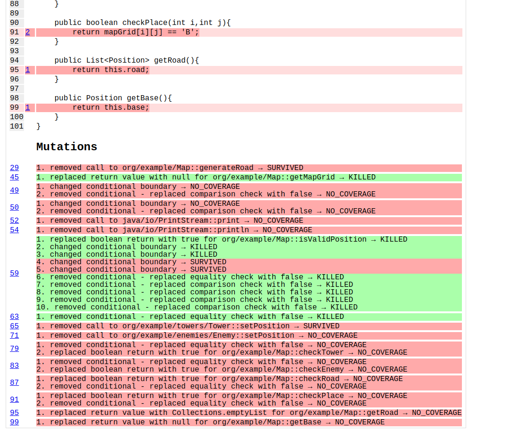

- Realiza un informe detallado sobre la calidad de las pruebas del proyecto Tower Defense,
basado en los resultados de las pruebas de mutación. Incluye recomendaciones para
mejorar la cobertura y efectividad de las pruebas.

**Rpta:**
Este es el informe:

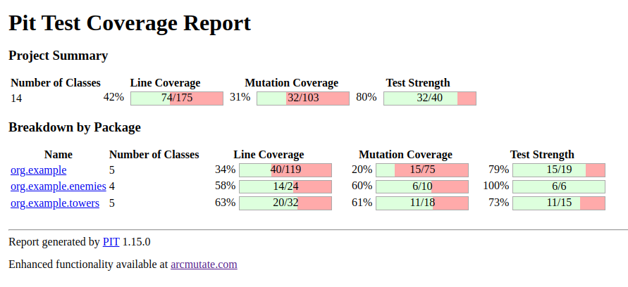

En este informe se puede ver una baja cobertura (20%) lo ideal seria hacer mas pruebas a cada clase y pruebas de integracion mas robustas tal que los mutantes no sobrevivan.


## Ejercicio 6: Diseño por contrato (Design by Contract) (2 puntos)

#### Teoría:
- Explica el concepto de diseño por contrato y cómo se aplica en el desarrollo de software.
Discute las diferencias entre precondiciones, postcondiciones e invariantes.

**Rpta:**
El diseño por contrato es una metodología del desarrollo de software que define las obligaciones y responsabilidades de los componentes del software mediante contratos que incluyen precondiciones, postcondiciones e invariantes. Esta metodología asegura interacciones predecibles y confiables entre los componentes. <br/>
Diferencias:
1. Precondiciones: Se verifican antes de la ejecución de un método y son responsabilidades del llamador del método.
Si no se cumplen, el método no se ejecutará correctamente.
2. Postcondiciones: Se verifican después de la ejecución de un método y son responsabilidades del método.
3. Invariantes: Se verifican antes y después de cualquier operación sobre un objeto, y son propiedades constantes que deben mantenerse durante todo el ciclo de vida del objeto.

- Describe cómo el diseño por contrato puede mejorar la robustez y mantenibilidad del código.

**Rpta:**
El diseño por contrato mejora la robustez al poner condiciones previas y posteriores de lo que se espera de cada metodo, ya que esto hace que se detecten errores temprano y se facilita la mantenibilidad del software mediante pruebas y refactorizaciones.

#### Práctico:
- Aplica el diseño por contrato a la clase Tower. Define las precondiciones, postcondiciones e
invariantes de los métodos principales de la clase.

**Rpta:**
En el metodo *setPosition()* se pone una precondicion y en *attack()* se define una pre y postcondicion:

```java
public class Tower {
    private int damage;
    private int range;
    private int fireRate; // turnos entre disparos
    private Position position;

    public Tower(int damage, int range, int fireRate) {
        this.damage = damage;
        this.range = range;
        this.fireRate = fireRate;
        this.position =  new Position(0, 0);
    }
    // Constructores, getters y setters
    public int getDamage() {
        return this.damage;
    }

    public void setDamage(int damage) {
        this.damage = damage;
    }

    public int getRange() {
        return this.range;
    }

    public void setRange(int range) {
        this.range = range;
    }

    public int getFireRate() {
        return this.fireRate;
    }

    public void setFireRate(int fireRate) {

        this.fireRate = fireRate;
    }

    public void setPosition(int x, int y) {
        // Precondición: el valor debe ser no negativo
        assert (x >= 0 || y >= 0) : "Coordinates has to be positive";
        position.setPosition(x, y);
    }

    public void attack(List<Enemy> enemies) {
        // Precondicion
        if (enemies.isEmpty()) {
            throw new IllegalArgumentException("Tienes que tener minimo 1 enemigo");
        }

        for (Enemy enemy: enemies){
            int x_diff = Math.abs(enemy.getPosition().getX() - position.getX());
            int y_diff = Math.abs(enemy.getPosition().getY() - position.getY());
            if ((x_diff <= range || y_diff <= range) && (x_diff == y_diff || x_diff == 0 || y_diff == 0)) {
                int preHealth = enemy.getHealth();
                enemy.downHealth(damage);
                // Post-condition
                assert enemy.getHealth() == preHealth - damage : "It must downgrade life";

            }
        }
    }
}
```

- Escribe pruebas unitarias que verifiquen el cumplimiento de los contratos definidos para la
clase Tower. Utiliza herramientas como Java Assertions para implementar estas
verificaciones.

```java
public class TowerContractTest {
    @Test
    public void testTowerPreCondition() {
        Tower tower = new Tower(30, 20, 2);
        Exception exception = assertThrows(IllegalArgumentException.class, () -> {
            tower.attack(new ArrayList<>());
        });
        assertEquals(exception.getMessage(), "Tienes que tener minimo 1 enemigo");
    }
}
```

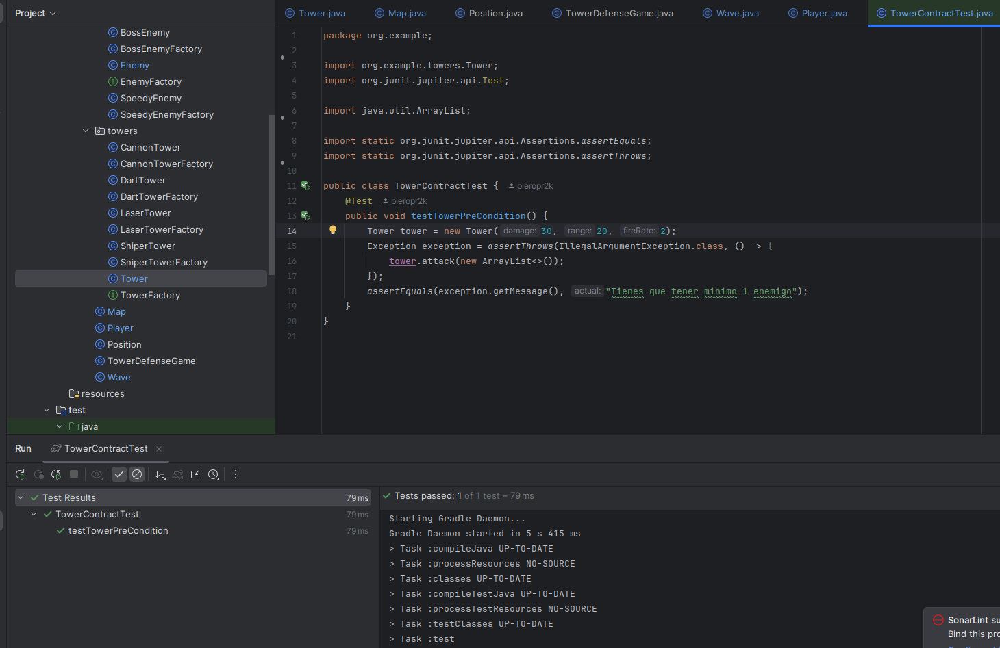

- Realiza una revisión de código para asegurarte de que todas las clases del proyecto Tower
Defense siguen los principios del diseño por contrato. Documenta cualquier ajuste o mejora
necesaria en el código.

**Rpta:**

En las siguientes clases se aplicaran los principios del diseño por contrato y se indicaran que metodos lo tienen:

En la clase Player el metodo deductBaseHealth tiene tanto Precondicion como Postcondicion:

```java
public class Player {
    private int score;
    private int baseHealth;
    public Player() {
        this.score = 0;
        this.baseHealth = 100;
    }
    public void addScore(int points) {
        this.score += points;
    }
    public void deductBaseHealth(int damage) {
        // Precondición: el valor debe ser no negativo
        assert damage >= 0 : "Damage down has to be positive";
        int baseHealthVal = this.baseHealth;
        baseHealthVal -= damage;
        // Postcondición: el valor del impuesto debe ser no negativo
        assert baseHealthVal >= 0 : "Life has to be positive";
        this.baseHealth -= baseHealthVal;
    }
    public int getScore() {
        return score;
    }
    public int getBaseHealth() {
        return baseHealth;
    }
    // Métodos adicionales según las necesidades del juego
    public void updateScoreAndHealth(Enemy enemy, boolean defeated){
        if (defeated) {
            this.addScore(enemy.getReward());
        } else {
            this.deductBaseHealth(25);
        }
    }
}
```

Para la clase Map, todos los metodos place tienen pre-condicion:

```java
public class Map {
    final int DIM = 5;
    private int rows;
    private int columns;
    private char[][] mapGrid;
    private List<Position> road;
    private Position base;

    public Map(){
        this.rows = DIM;
        this.columns = DIM;
        //this.mapGrid = new int[rows][columns];
        this.base = new Position(2, 4);
        this.mapGrid = new char[][] {
                {' ', ' ', 'C', ' ', ' '},
                {' ', 'C', ' ', ' ', ' '},
                {'C', ' ', ' ', 'C', 'B'},
                {' ', ' ', 'C', ' ', ' '},
                {' ', ' ', ' ', ' ', ' '}
        };
        generateRoad();

    }

    public void generateRoad() {
        this.road = List.of(new Position(2,0),
                new Position(1,1),
                new Position(0,2),
                new Position(3,1),
                new Position(3,2),
                new Position(2,3),
                new Position(2, 4)
        );
    }

    public char[][] getMapGrid() {
        return this.mapGrid;
    }

    public void printMap(){
        for (int i = 0; i < rows; i++) {
            for (int j = 0; j < columns; j++) {
                String mapElement = "[" + mapGrid[i][j] + "]";
                System.out.print(mapElement);
            }
            System.out.println();
        }
    }

    public boolean isValidPosition(int x, int y){
        return (x >= 0 && x < rows) && (y >= 0 && y < columns) && mapGrid[x][y] == ' ';
    }

    public void placeTower(Tower tower, int x, int y) {
        if (this.isValidPosition(x,y)) {
            mapGrid[x][y] = 'T';
            tower.setPosition(x, y);
        }
    }
    
    // Aca esta las precondiciones:

    public void placeEnemy(Enemy enemy, int x, int y) {
        // Precondición: el valor debe ser no negativo
        assert (x >= 0 || y >= 0) : "Coordinates has to be positive";
        mapGrid[x][y] = 'E';
        enemy.setPosition(x, y);
    }

    public void placeRoad(int x, int y) {
        // Precondición: el valor debe ser no negativo
        assert (x >= 0 || y >= 0) : "Coordinates has to be positive";
        mapGrid[x][y] = 'C';
    }

    public boolean checkTower(int i,int j){
        return mapGrid[i][j] == 'T';
    }

    public boolean checkEnemy(int i,int j){
        return mapGrid[i][j] == 'E';
    }

    public boolean checkRoad(int i,int j){
        return mapGrid[i][j] == 'C';
    }

    public boolean checkPlace(int i,int j){
        return mapGrid[i][j] == 'B';
    }

    public List<Position> getRoad(){
        return this.road;
    }

    public Position getBase(){
        return this.base;
    }
}
```

En el metodo generateEnemies() de la clase Wave se pone una precondicion:

```java
public class Wave {
    private List<Enemy> enemies;
    private int waveNumber;
    private Map map;

    public Wave(int waveNumber) {
        this.waveNumber = waveNumber;
        this.enemies = generateEnemies(waveNumber);
    }
    private List<Enemy> generateEnemies(int waveNumber) {
        // Precondición: el valor debe ser no negativo
        assert waveNumber >= 0 : "Value has to be positive";
        List<Enemy> enemies = new ArrayList<>();
        for (int i = 0; i < waveNumber * 5; i++) { // más enemigos cada oleada
            enemies.add(new BasicEnemyFactory().createEnemy());
        }
        if (waveNumber % 5 == 0) { // jefe cada 5 oleadas
            enemies.add(new BossEnemyFactory().createEnemy());
        }
        if (waveNumber % 7 == 0) { // jefe cada 5 oleadas
            enemies.add(new SpeedyEnemyFactory().createEnemy());
        }
        return enemies;
    }
    // Métodos para manejar el progreso de la oleada
    public List<Enemy> spawnEnemies() {
        char[][] map = this.map.getMapGrid();

        List<Position> spawnPoints = new ArrayList<>();
        for (int i = 0; i < map.length; i++) {
            for (int j = 0; j < map[i].length; j++) {
                if (map[i][j] == 'C') {
                    spawnPoints.add(new Position(i, j));
                }
            }
        }
        for (Enemy enemy : enemies) {
            if (!spawnPoints.isEmpty()) {
                Position spawnPoint = spawnPoints.remove(0);
                this.map.placeEnemy(enemy, spawnPoint.getX(), spawnPoint.getY());
                System.out.println("Enemy spawned at (" + spawnPoint.getX() + ", " + spawnPoint.getY() + ")");
            } else {
                break;
            }
        }
        return enemies;
    }

    public List<Enemy> getEnemies() {
        return this.enemies;
    }

    public void setEnemies(List<Enemy> enemies){
        this.enemies = enemies;
    }

}
```

En la clase Enemy se crea en el metodo *downHealth()* la pre-condicion y post-condicion y en *setReward()* la pre-condicion:

```java
public class Enemy {
    private int speed; // número de celdas por turno
    private int health;
    private int reward;
    private Position position;

    public Enemy(int speed, int health, int reward) {
        this.speed = speed;
        this.health = health;
        this.reward = reward;
        this.position = new Position(0, 0);
    }
    // Constructores, getters y setters
    public int getSpeed(){
        return this.speed;
    }
    public void setSpeed(int speed){
        this.speed = speed;
    }
    public int getHealth(){
        return this.health;
    }
    
    // Los contratos:
    public void downHealth(int damage){
        // Pre-condition
        assert damage >= 0 : "Damage down has to be positive";
        int healthVal = this.health;
        healthVal -= damage;
        // Post-condition
        assert healthVal >= 0 : "Health has to be positive";
        this.health = healthVal;
    }
    public int getReward(){
        return this.reward;
    }

    public void setReward(int extra){
        // Pre-condition
        assert extra >= 0 : "Extra reward has to be positive";
        this.reward = this.reward + extra;
    }
    public void setPosition(int x, int y) {
        position.setPosition(x, y);
    }
    public Position getPosition() {
        return this.position;
    }
}
```
